<!-- _class: titlepage -->

# Expedition Tiefsee
## Projektbezogene Geovisualisierung VI (G7) SPO 2022

###### Prüfungsnummer 6322340 Betreuer Stefan Sauer
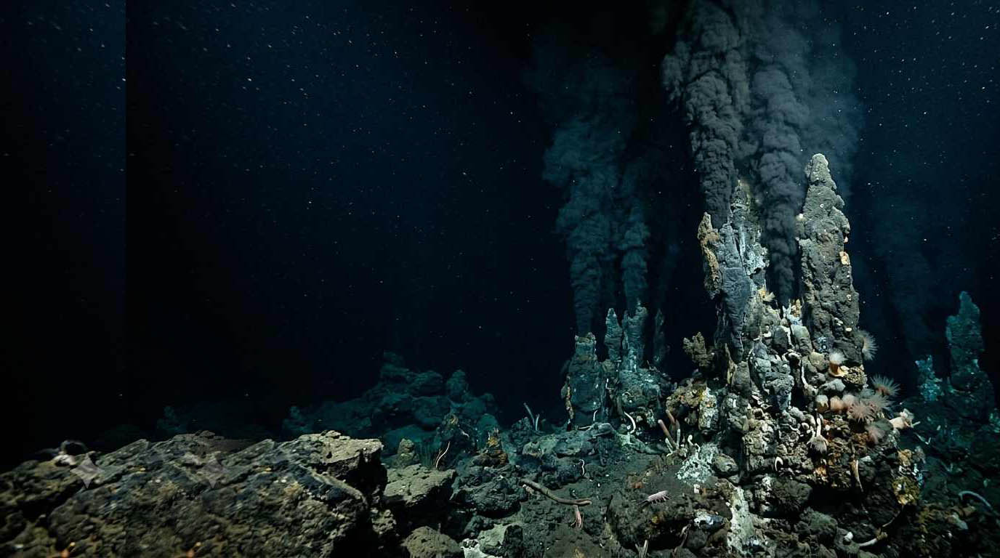

---

<!-- _class: structural -->

# Auf der Jagd nach den schwarzen Rauchern.

Hier kommt die Story Film / Audio sonst was rein

---
<!-- _class: structural -->
# Agenda / Inhalt

- [Expedition Tiefsee](#expedition-tiefsee)
  - [Projektbezogene Geovisualisierung VI (G7) SPO 2022](#projektbezogene-geovisualisierung-vi-g7-spo-2022)
- [Auf der Jagd nach den schwarzen Rauchern.](#auf-der-jagd-nach-den-schwarzen-rauchern)
- [Projektübersicht & Rahmendaten](#projektübersicht--rahmendaten)
  - [Vision & Zielsetzung](#vision--zielsetzung)
  - [Die Aufgabenstellung](#die-aufgabenstellung)
  - [Projektpartner](#projektpartner)
  - [Zielplattform: Die CAVE im MAVEL-Lab Schweinfurt](#zielplattform-die-cave-im-mavel-lab-schweinfurt)
  - [Zielgruppen & Interdisziplinäre Zusammensetzung](#zielgruppen--interdisziplinäre-zusammensetzung)

---
<!-- _class: structural -->

- [Die Story & das didaktische Konzept](#die-story--das-didaktische-konzept)
  - [Narrative Dramaturgie](#narrative-dramaturgie)
  - [Das Projektgebiet](#das-projektgebiet)
  - [Die Schlüsselstationen](#die-schlüsselstationen)
  - [Gamification & Live-Feed-Gedanke](#gamification--live-feed-gedanke)
- [Exkursion nach Bremerhaven](#exkursion-nach-bremerhaven)
  - [Ziele der Exkursion](#ziele-der-exkursion)
  - [Daten und Fakten](#daten-und-fakten)
  - [Ablauf & Programm](#ablauf--programm)
  - [Arbeitsaufträge für die Exkursionsphase](#arbeitsaufträge-für-die-exkursionsphase)

---
<!-- _class: structural -->

- [Organisation & Ablauf](#organisation--ablauf)
  - [Terminplanung (Semesterübersicht)](#terminplanung-semesterübersicht)
  - [Prüfungs- und Bewertungskriterien](#prüfungs--und-bewertungskriterien)
  - [Betreuungskonzept](#betreuungskonzept)
- [Interdisziplinäre Teamstruktur & Aufgabenverteilung](#interdisziplinäre-teamstruktur--aufgabenverteilung)
  - [Team-Übersicht](#team-übersicht)
- [Technische Infrastruktur, Tools & Vorhandene Assets](#technische-infrastruktur-tools--vorhandene-assets)
  - [Software-Stack & Hardware](#software-stack--hardware)
  - [Dokumentation & Kollaboration](#dokumentation--kollaboration)
  - [Bestands-Assets aus 2025/26](#bestands-assets-aus-202526)

---
<!-- _class: structural -->

- [Inspirationen](#inspirationen)
  - [Bücher](#bücher)
  - [Filme](#filme)
  - [Material AWI](#material-awi)
  - [Artikel](#artikel)

---
<!-- _class: kapitelende-->

---
<!-- _class: structural -->
# Projektübersicht & Rahmendaten
> Was bewegt uns, unsere Erde zu schützen, wenn das noch nicht einmal der eigene Selbsterhaltungstrieb vermag?
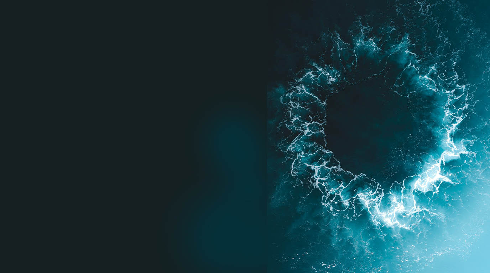

---
<!-- _class: structural -->

> Die Liebe!

> Lasst uns also den Menschen die Liebe zur Tiefsee einpflanzen, damit eine tiefe Liebe zu dieser faszinierenden Welt entsteht.

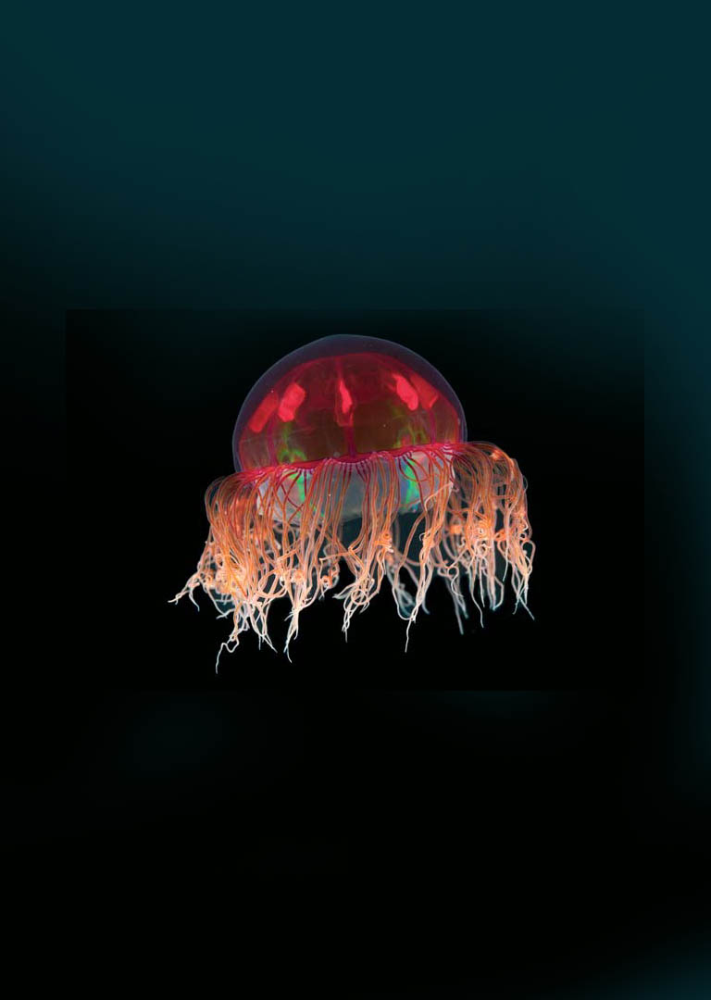

---
<!-- _class: structural -->

## Vision & Zielsetzung

<i>"Wir wollen ein einzigartiges immersives Erlebnis schaffen, bei dem die Besuchenden die intensive Erfahrung machen, in einem Tauchboot auf dem Grund der Tiefsee zu sein."</i>

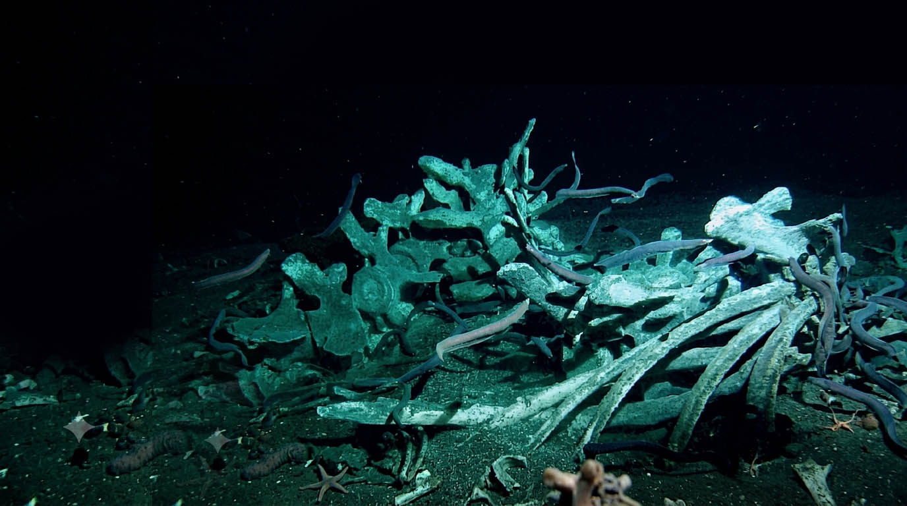

---

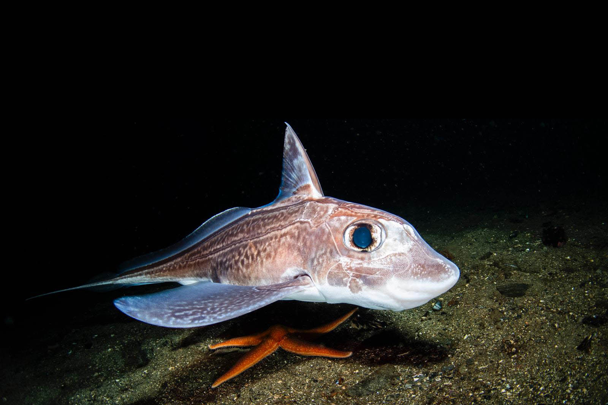

---
<!-- _class: structural-->
Die Besuchenden sollen: 
> ... fasziniert werden von der Schönheit der Tiefsee

> ... die Verletzlichkeit des Ökosystems verstehen

> ... motiviert werden, sich für den Schutz der Tiefsee einzusetzen
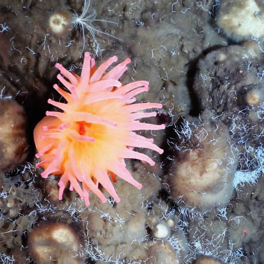

---
<!-- _class: text-80 structural-->
## Die Aufgabenstellung

Entwickeln und konzeptionieren Sie in Teamarbeit eine **Mixed-Reality**-Anwendung in **Unreal 5.8**, die den Betrachter auf die Schönheit der weitgehend unbekannten Unterwasserwelt aufmerksam macht. Zielplattform der Anwendung ist die **CAVE** im **MAVEL-Lab** der THWS in Schweinfurt. 
Vermitteln Sie das Gefühl der **Dringlichkeit**, dieses unersetzliche Ökosystem zu behüten und zu erforschen, ohne es zu beeinträchtigen.
Befassen Sie sich **intensiv** mit der **Story** und weiterführend mit dem **Thema Tiefsee**.
Ordnen Sie sich dann einem der sieben Teams zu und besprechen Sie im Team die zu bearbeitenden Teilaufgaben.
Erlernen Sie die für Sie erforderlichen Software-Komponenten und Werkzeuge.

---
<!-- _class: text-80 structural-->

Am Ende der Veranstaltung erfolgt eine mediale Live-Präsentation durch die Verfasser*innen sowie eine Ausstellung der Ergebnisse. Abgabe als gemeinsames DIN A1 Hochformat Plakat (gedruckt) und als individuelle Präsentation der eigenen Arbeitsergebnisse.
Mit der Teilnahme am Kurs stimmen Sie einer möglichen Veröffentlichung Ihrer Arbeit durch die Hochschule und das AWI zu. Die im Rahmen der Arbeit entstandenen Werke verbleiben in Ihrem Urheberrecht, die zeitlich und räumlich unbeschränkten Nutzungsrechte zu Werbe- und Veröffentlichungszwecken und Weiterverwendung erhält die THWS, sowie das AWI.

---
<!-- _class: kapitelende-->

---

## Projektpartner

Das Projekt entsteht in einer Kooperation aus:

**Technische Hochschule Würzburg-Schweinfurt**
- Fakultät FKV Kunststofftechnik und Vermessung,
Studiengang Geovisualisierung
- Fakultät FIW Informatik und Wirtschaftsinformatik

**MAVEL-Lab der THWS**
- Fakultät Wirtschaftsingenieurwesen

**Alfred-Wegener-Institut**
- Helmholtz-Zentrum für
Polar- und Meeresforschung (AWI)

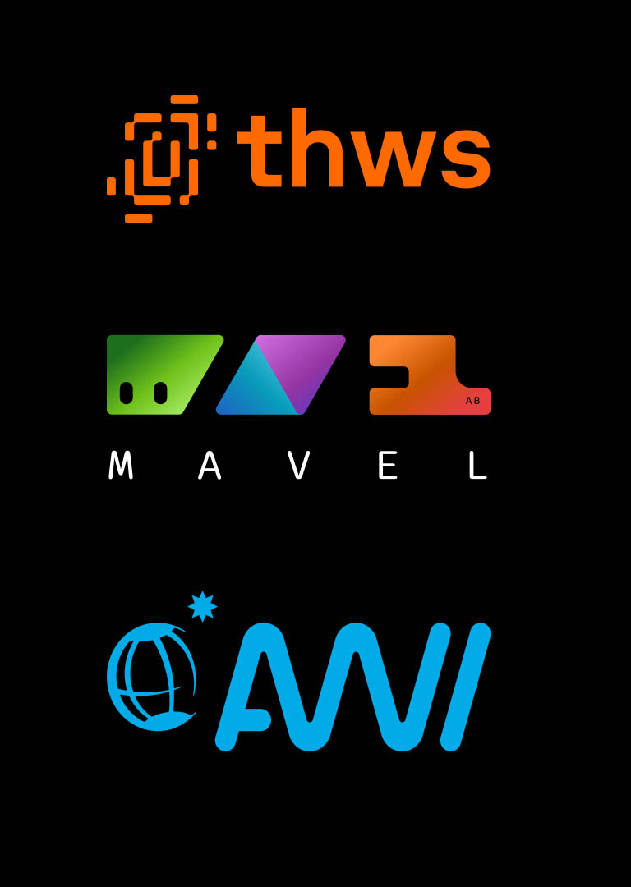

---
### thws

Interdisziplinäres Projekt innerhalb der THWS unter
Einbeziehung von Studierenden unterschiedlicher Fakultäten.

#### FKV Studiengang [Geovisualisierung](https://geo.thws.de)
- "Projektbezogene Geovisualisierung" als Modul
des siebten Semesters
- Schwerpunkte: 3D Visualisierung, Animation, VR

#### FIW
- Wahlpflichtmodul
- Studiengänge: Informatik, Wirtschaftsinformatik,
Informationssicherheit, Digitale Gesellschaft
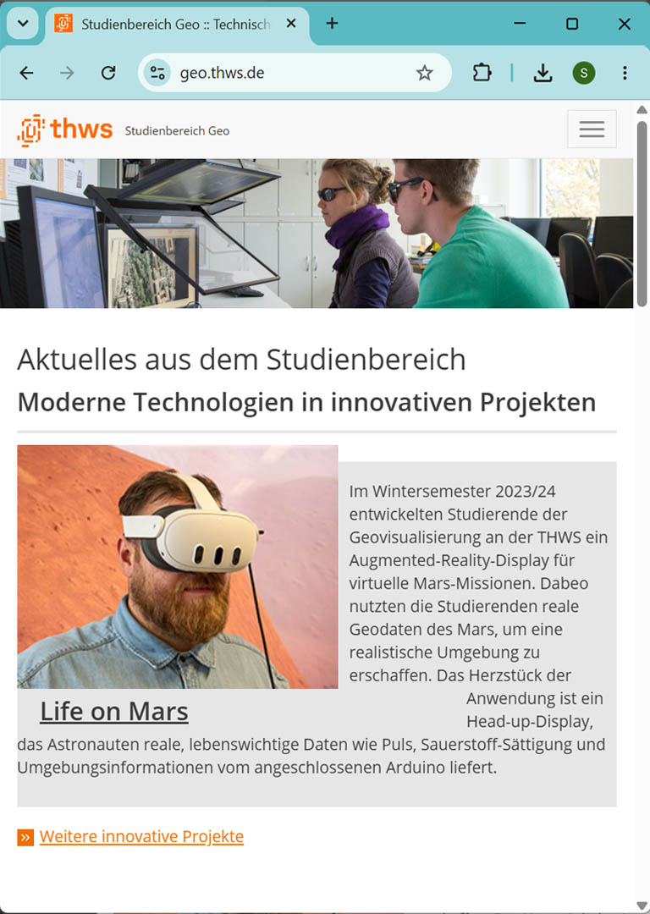

---
### Mavel Lab der thws
- Labor der Fakultät FWI
- Kooperiert mit der freien Wirtschaft
- Forschung und Lehre

Eigene Webseite:
https://mavel.rocks
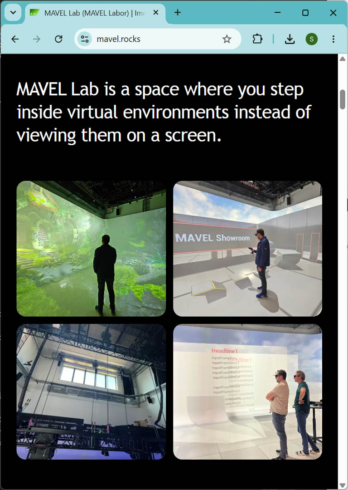

---

**Beschreibung des Labors**
**Gründung**: 2022
**MAVEL** – Mixed Augmented Virtual Experience Learning Lab
**Standort**: THWS, Ledward Campus, Raum 20.E.22
**Mission**:
Dinge und Erfahrungen greifbar und erlebbar machen, die sonst nur schwer zugänglich sind und/oder eine Gefahr für Leib und Leben darstellen. Menschen dazu inspirieren, Extended Reality (XR) in ihrem jeweiligen Fach- und Anwendungsbereich einzusetzen.
**Vision**:
Kompetenzzentrum für multisensorische Anwendungen von Extended Reality (XR).
**Zielgruppen**:
Studierende, Industrie und Forschung.

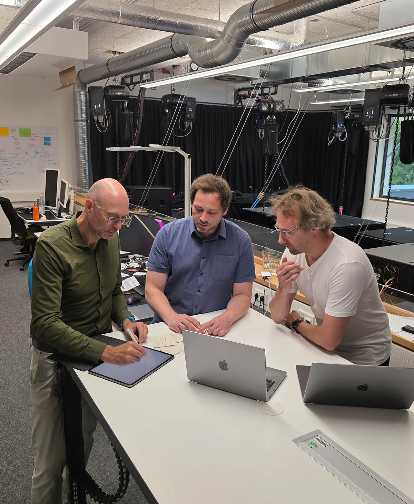

---
**Partnerships and Collaborations**
- Internal: IDIS, IDEE, Plastics Engineering and Surveying,
Architecture and Civil Engineering, Business School, CERI
- Academic: Innovation Management, Design Thinking, VR Deep Sea Exploration (FWPM)
- Industry: Koenig & Bauer, Schaeffler, Bosch Rexroth, Hilti, Fresenius, Würth
- Government Agencies: Bayerisches LKA, Museum für Franken, Feuerwehrschule
Würzburg
- Memberships: XR HUB BAVARIA

---
**People**
- Lab Director: Prof Dr. Uwe Sponholz
- Staff:
  - Dominik Fritsch (Technical Lead)
  - Florian Schuster (Course Coordination)
  - Raman Chakraborty (Research Associate)
  - Chris Haselhoff (Hardware Engineering)

**Competencies**
Human Centred Design, XR VR, MR, Unreal, wave field synthesis, coding
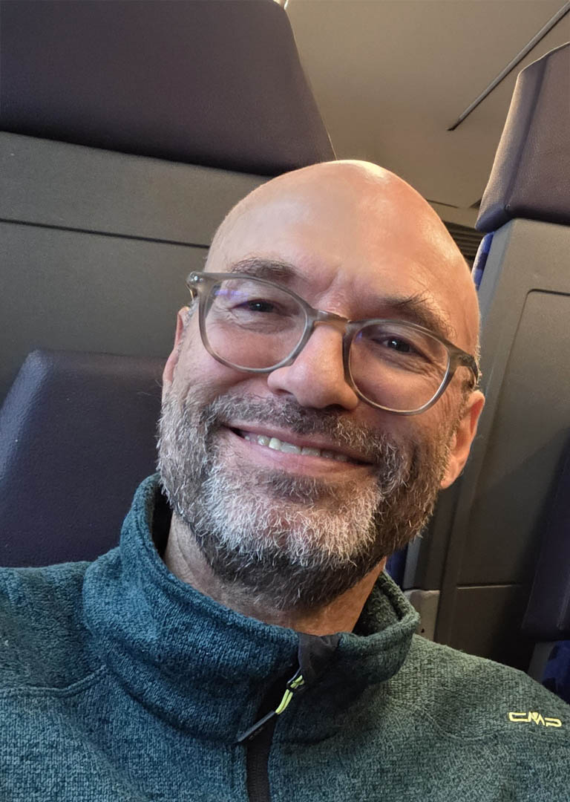

---
**Research focus and Capabilities**
**Core Areas:**
- Application of Extended Reality Technologies for the simulation of multisensory experiences

**Technologies & Equipment:**
- High-performance Computer Cluster, 3D Glasses, CAVE-System, Audio spatial Sound Wave
- System, Media Truss System, Realtime Engines, Media Technology, Building Automation System
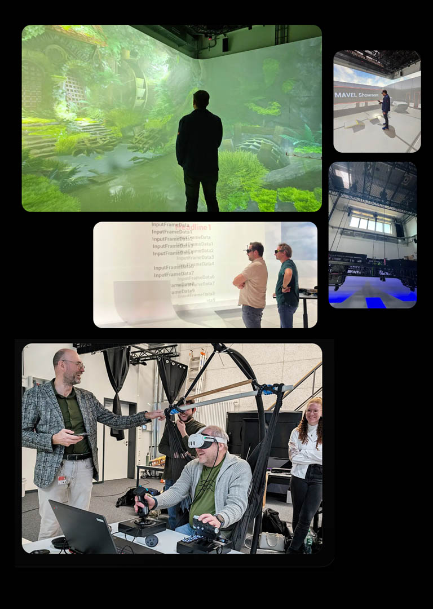

---
### Alfred Wegener Institut AWI

- Forschungsinstitut mit Sitz in Bremerhaven
- Spezialisiert auf Erforschung der Polarregionen
- Gegründet am 15. Juli 1980.
- Mitglied der Helmholtz-Gemeinschaft Deutscher Forschungszentren.
- Namensgeber: der Polarforscher &
Geowissenschaftler Alfred Wegener.
- Jahresbudget 2022 ca. 202,9 Millionen Euro
- Mehr als 900 Mitarbeitende.
https://awi.de/

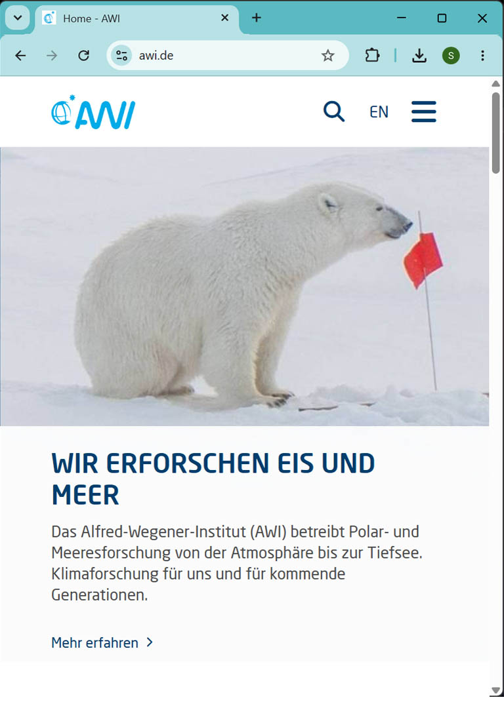

---
**Forschungsbereiche**

- **Geowissenschaften**: Geologischer Aufbau der
Polarregionen, Eisschilde, Sedimente, Erdkruste, Permafrost.
- **Biowissenschaften**: Ökologie, Physiologie, Ökosysteme,
Plankton, Kaltwasserkorallen etc.;
- **Klimawissenschaften**: Wechselwirkungen Ozean-Eis-Atmosphäre; Modellierung des Klimasystems;
Untersuchung menschlich verursachter und natürlicher Klimaveränderungen
https://www.awi.de/forschung/forschungs-programm.html

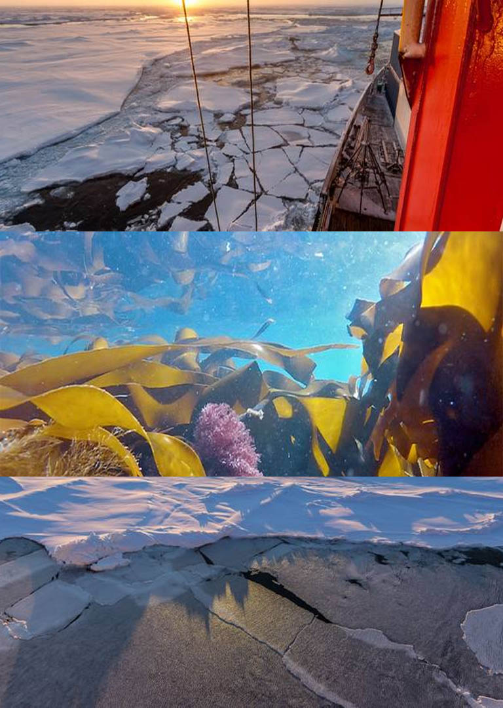

---
**Dr. Frank Wenzhöfer**
Wissenschaftler am AWI für Tiefseeökologie und –technologie
Forschungsschwerpunkte:
- Benthische Ökologie und biogeochemische Prozesse-
Benthische Primärproduktion
- Hadal-Graben-Systeme
- Biogeochemie von kalten Quellen und hydrothermalen Schloten
- Mariner Kohlenstoffkreislauf-Sensortechnologie

https://www.awi.de/forschung/biowissenschaften/tiefsee-oekologie-und-technologie.html

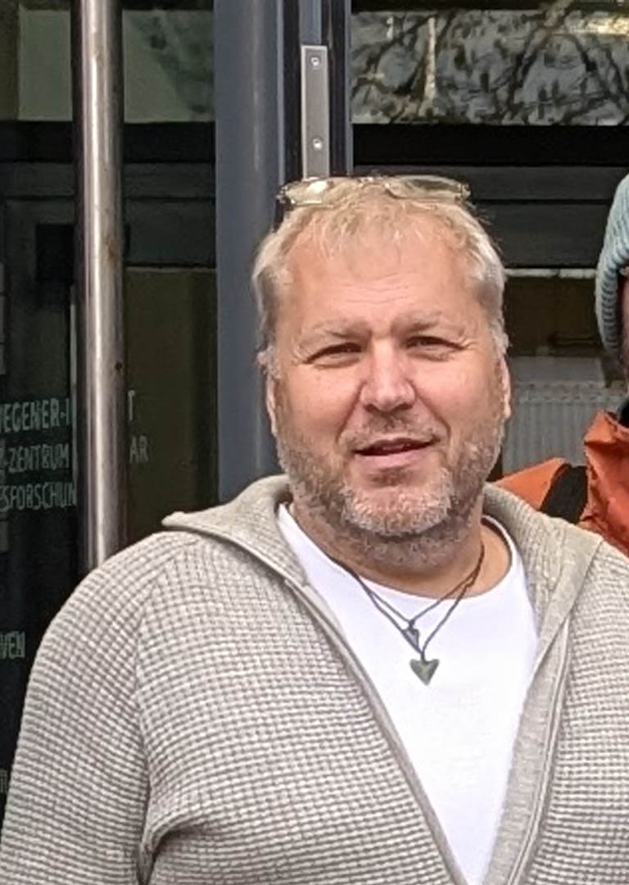

---
## Zielplattform: Die CAVE im MAVEL-Lab Schweinfurt
Die CAVE (Cave Automatic Virtual Environment) des MAVEL-Labs an der THWS in Schweinfurt ist eine hochinnovative, immersive VR-Umgebung

- Raumfüllendes VR-System mit vierseitiger Projektion
- Größte Cave Europas (10m x  5m x 5m)
- immersive virtuelle Realität, mit leichten Shutterbrillen
- Kombination von realen und virtuellen Objekten / physischen Mockups
- Mixed Augmented Virtual Experience
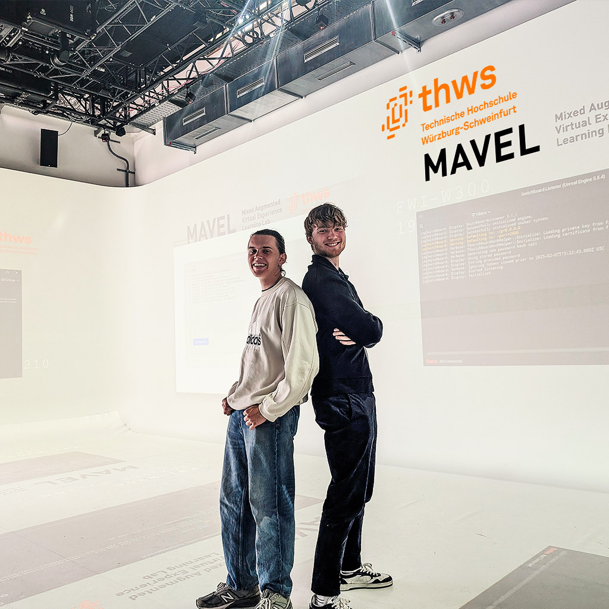

---
## Zielgruppen & Interdisziplinäre Zusammensetzung

### Ziele und Zielgruppe der thws
- Kollaboration unterschiedlicher Charaktere und Kompetenzen
- Simulierung realer Projektbedingungen
- Projekt mit starker Außen- und Innenwirkung
- Breite Zielgruppe, von Studierenden, über Lehrende, bis Studieninteressierte
- Stärkung der Nachhaltigkeitsdimension der THWS
- Einbindung von Schulen im Raum Schweinfurt und Würzburg (Ticketverlosung für die Abschlussveranstaltung)

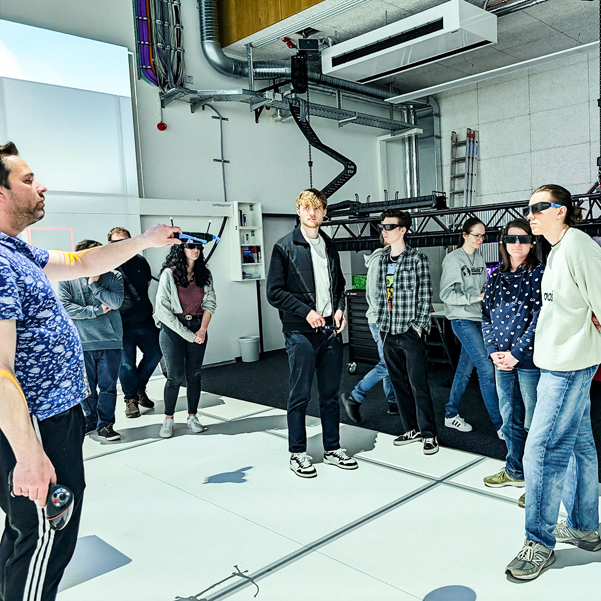

---
### Ziele und Zielgruppe des MAVEL-Labs
- Erreichen von Menschen in Entscheiderpositionen
- Einwerben von Forschungsprojekten und Forschungsmitteln
- Überregionale Bekanntheit
- Veranschaulichung der immersiven Technologie
- Neue Anwendungsszenarien für Cave- und XR-Technologien

---
### Ziele und Zielgruppe des AWI
Gesellschaftliche Relevanz der Ozeane verdeutlichen: 
- Schutz der Ozeane
- Verständnis für die Ozeane (ca. 25% sind kartiert, <1% sind visuell bekannt)
- Zu wenig Wissen für Verständnis von Veränderungen und deren Folgen
- Viele unbekannte Lebensräume, Organismen und Prozesse
- aber vielleicht auch Antworten auf dringende Fragen

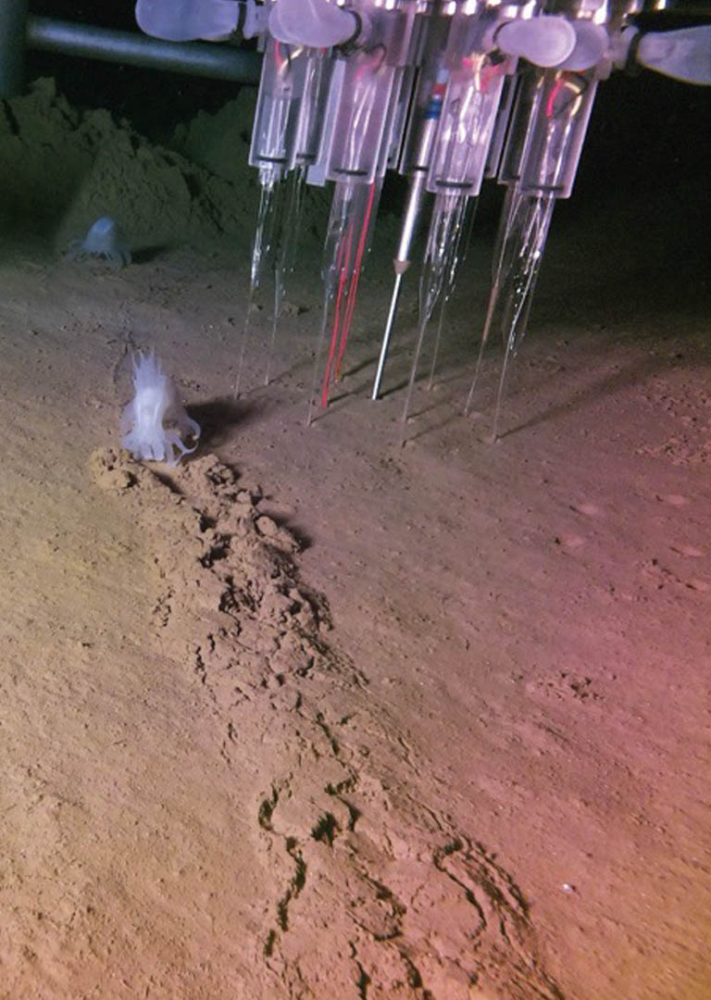

---
<!-- _class: kapitelende-->

---

<!--_class: structural-->
# Die Story & das didaktische Konzept

> Vor dem Erlebnis steht die Anspannung, das Erwarten und die Stille.
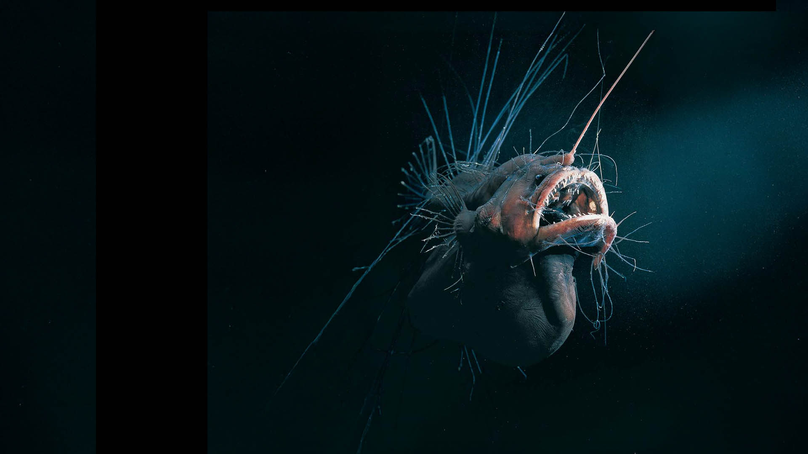

---
<!--_class: text-80 structural-->
## Narrative Dramaturgie

- Das Erlebnis wird wie eine reale Tauchfahrt organisiert
- Beginnt bereits bei der Ankunft in Schweinfurt
- Vor dem Erlebnis erfolgt eine Briefing-Phase
- Inszenierung erhöht die Anspannung
- Tauchfahrt vom gleißenden Sonnenschein in die
absolute Dunkelheit der Tiefsee
- Interaktion mit dem Expeditionsleiter (digitaler Frank)
- Enge, Kälte, Stille und fremde Geräusche als Begleiter
- Am Tiefseegrund Kontrast zwischen Schönheit und Zerstörung
- Zurück in die Realität nach dem Auftauchen,
Rollos werden geöffnet
- Expeditionsziele werden vorgegeben und während der
Tauchfahrt mit Kommandobrücke der Polarstern besprochen!

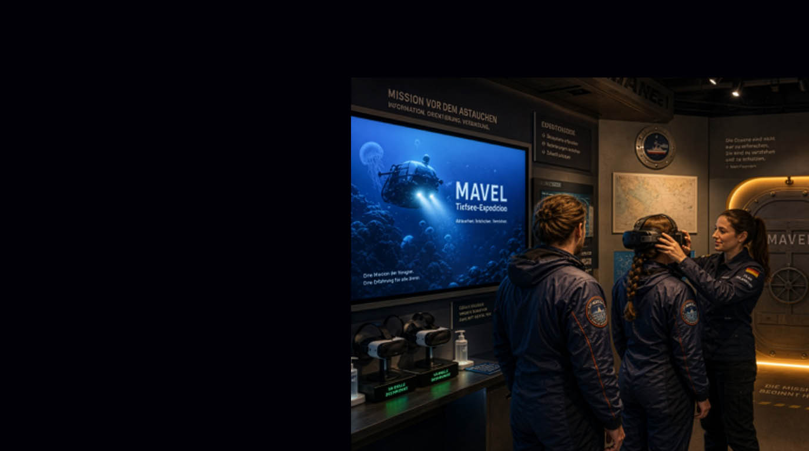

---
## Das Projektgebiet
Ein möglicher Spielort für unsere Anwendung

- Clarion-Clipperton-Zone CCZ
- Lage zwischen Hawaii und Mexico
- langgestrecktes Rechteck im Ostpazifik
- Breite ca. 7000 km

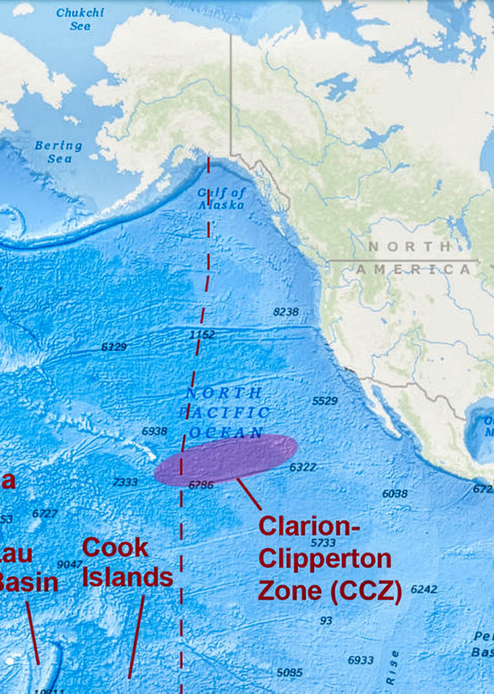

---

| Ecke | Breitengrad (°N) | Längengrad (°W) |
|---|---|---|
| Nordwest | 18.0 | −160.0 |
| Nordost | 18.0 | −115.0 |
| Südwest | 3.0 | −160.0 |
| Südost | 3.0 | −115.0 |

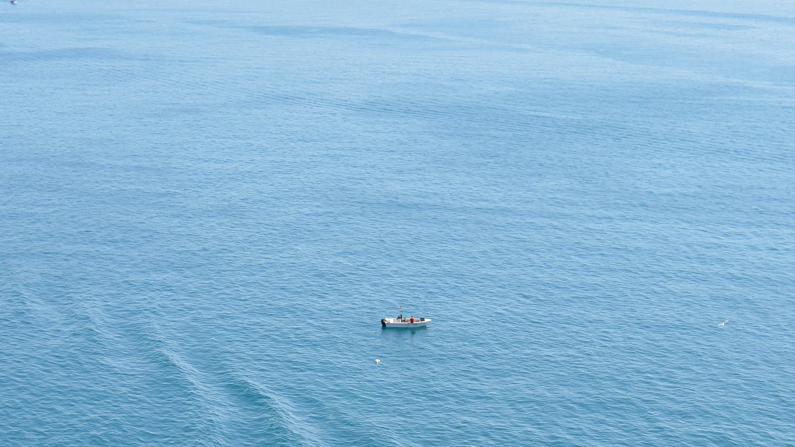

---
### Tiefsee Bergbau
- Hohe Vorkommen von Manganknollen in der CCZ
- Bundesrepublik Deutschland erwarb 2006 eine 15 Jahre
 gültige Erkundungslizenz
- AWI, Geomar, Marum erforschen
Auswirkungen des Tiefsee-Bergbaus

https://de.wikipedia.org/wiki/Clarion-Clipperton-Zone

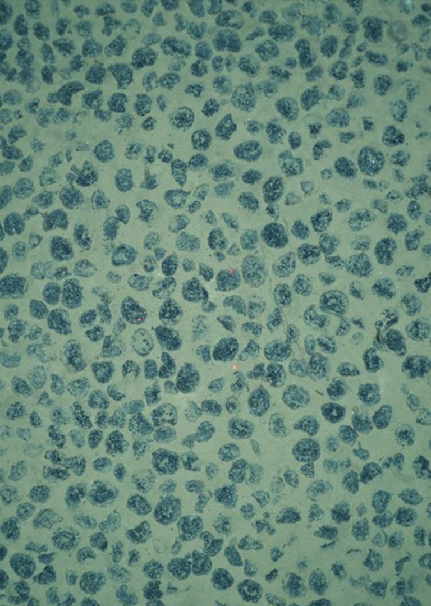

---
### Deutsches Ressourcen-Forschungsgebiet im Pazifik
- Forschungslizenz seit 2006
- Ziel: Abbau mineralischer Ressourcen im Tiefseebergbau
- Reine Forschungslizenz, kein Abbau
- Hohe Vielfalt der Mikrofauna
- Die bisherigen Erkenntnisse wurden fast ausschließlich durch wissenschaftliche Expeditionen gewonnen
- Lizenzierte Unternehmen legen ihre Untersuchungen
i. d. R. nicht offen

https://de.wikipedia.org/wiki/Deutsches_Ressourcen-Forschungsgebiet_im_Pazifik
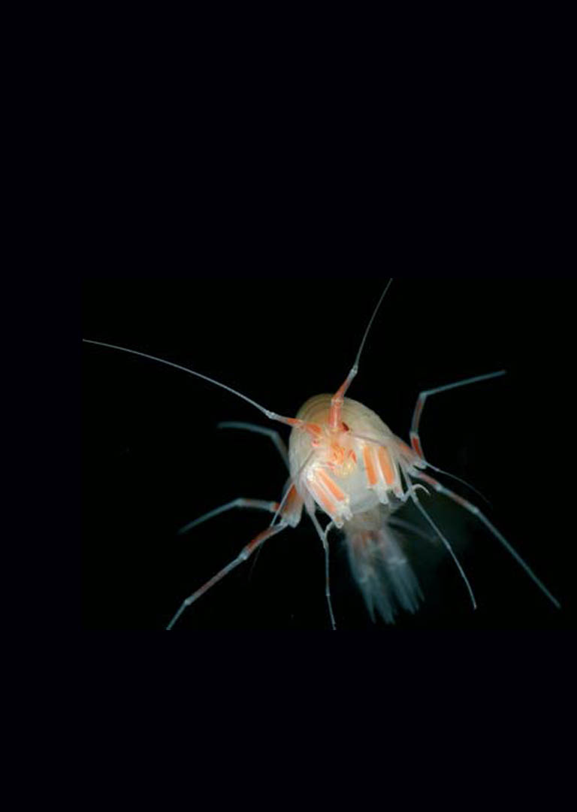

---
### Ökosystem des CCZ

- Seeberge (Seamounts) als einzigartige Artengemeinschaften
- Seeberge mit Schwamm- und Korallengärten
→ Lebensraum für Krustentiere, Muscheln, Seesterne,
viele bodenbewohnende Organismen.
- Schwarze Raucher (Hydrothermalquellen) als dicht
besiedelte Lebensräume der Tiefsee
- Chemosynthese
(Bakterien wandeln Schwefelwasserstoffe in Energie)

https://de.wikipedia.org/wiki/Deutsches_Ressourcen-Forschungsgebiet_im_Pazifik
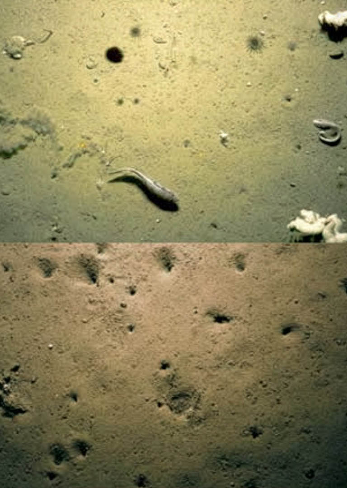

---
<!-- _class: structural -->
### Folgen des Tiefseebergbaus
- Grundsätzliche Störung des marinen Ökosystems
- Erheblicher Eingriff in den Lebensraum Meer.
- Lärm & Vibrationen vergleichbar mit Offshore-Windanlagen → Störung von Delfinen & Walen
- Technisch laute Prozesse (Herauspumpen/Reinigen der Knollen)
- Im Abbaugebiet sterben Tiere, die nicht fliehen können (z. B. Würmer, Schnecken, Seegurken)
- Umweltbundesamt warnt vor erheblichen Auswirkungen auf ozeanische Lebensräume.

https://de.wikipedia.org/wiki/Deutsches_Ressourcen-Forschungsgebiet_im_Pazifik

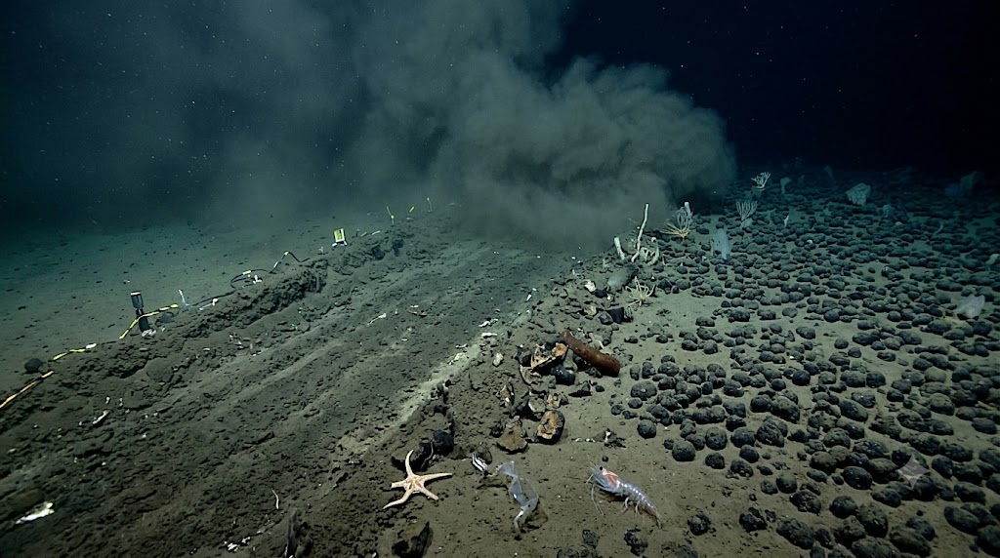

---
### Daten des Gebiets
- Download unter https://www.gebco.net/
- Freie Daten verfügbar
- Z.B.: https://www.gebco.net/data-products/gridded-bathymetry-data
- Verwendung in ArcGIS möglich

---

<!-- _class: kapitelende-->

---
<!-- _class: structural -->
## Die Schlüsselstationen
- Manganknollenfeld
- Whalefall
- Eisfischnester
- Schwarze Raucher
- Erkundung neuer Habitate (visuelle Inspektion (< 1%)
- Kartografieren (< 25%)
- Kernbohrungen

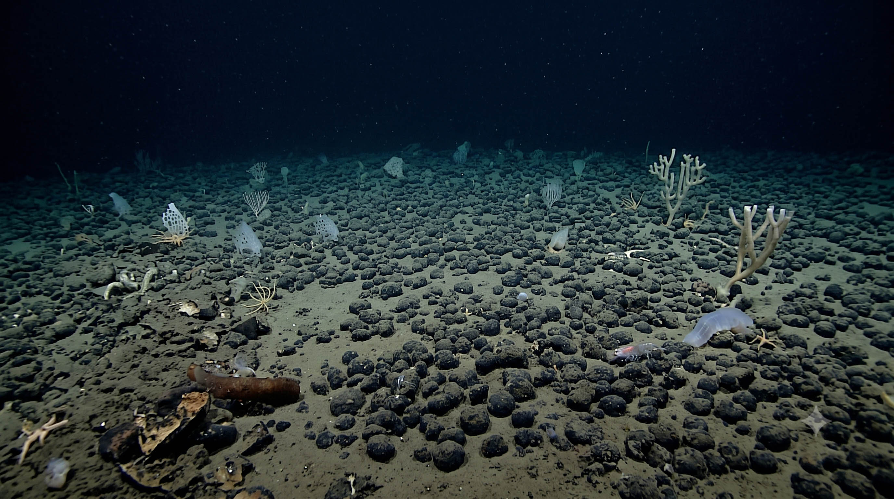

---
### Schlüsselstation Manganknollenfeld

**Die Clarion-Clipperton-Zone (CCZ):**
Ein riesiges, ca. 4,5 Millionen Quadratkilometer
großes Tiefseegebiet im Zentralpazifik zwischen
Hawaii und Mexiko.
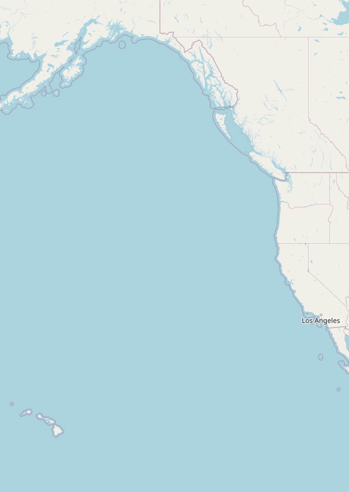

---

**Ressourcen (Manganknollen):**
Kartoffelgroße Knollen in 4.000 bis 5.000 Metern Tiefe,
die neben Mangan wertvolle Metalle wie Kobalt, Nickel,
Kupfer und Seltene Erden enthalten (wichtig für die
Energiewende und Batterietechnik).
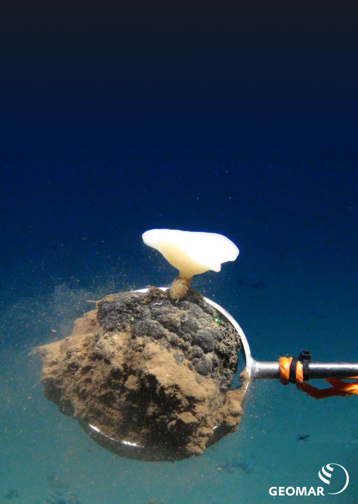

---

**Geplante Abbautechnologie:**
Einsatz schwerer, ferngesteuerter Unterwasser-
Raupenfahrzeuge (Kollektoren), die den Meeresboden
umpflügen, die Knollen einsammeln und über ein
Rohrsystem zu einem Schiff an der Oberfläche pumpen.
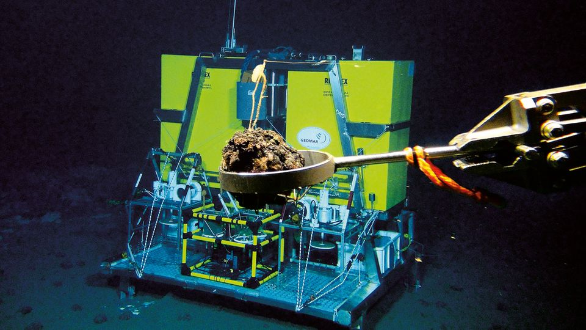

---
<!-- _class: structural -->
**Ökologische Risiken:** 
  - Massive Zerstörung des extrem empfindlichen und langsam wachsenden benthischen Ökosystems.
  - Aufwirbeln riesiger Sedimentwolken, die sich über weite Strecken verteilen und Filterfiltrierer sowie andere Lebewesen ersticken können.
  - Erhebliche Lärm- und Lichtverschmutzung in einem
  ansonsten dunklen und stillen Lebensraum.
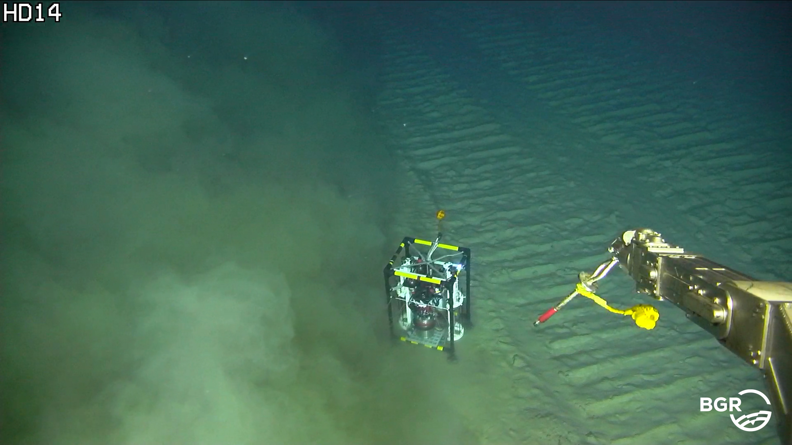

---

**Rechtliche Regulierung (ISA):**
Die Internationale Meeresbodenbehörde (International Seabed Authority) verwaltet die Ressourcen in internationalen Gewässern, vergibt Explorationslizenzen und verhandelt derzeit über ein Regelwerk für den kommerziellen Abbau (Mining Code).

---

**Aktueller Status & Kontroverse:**
Während einige Staaten und Unternehmen auf einen baldigen Start des industriellen Abbaus drängen, fordern viele Wissenschaftler, Umweltschutzorganisationen und Staaten ein Moratorium, bis die ökologischen Folgen besser erforscht sind.

---
<!-- _class: structural -->
### Schlüsselstation Whalefall
**Was ist ein Whalefall?**
Wenn der Kadaver eines großen Wals (z.B. Blau- oder Pottwal) auf den Meeresboden der Tiefsee sinkt, spricht man von einem "Whalefall". Er bringt schlagartig gigantische Mengen an Nährstoffen in einen ansonsten sehr nahrungsarmen, dunklen Lebensraum.

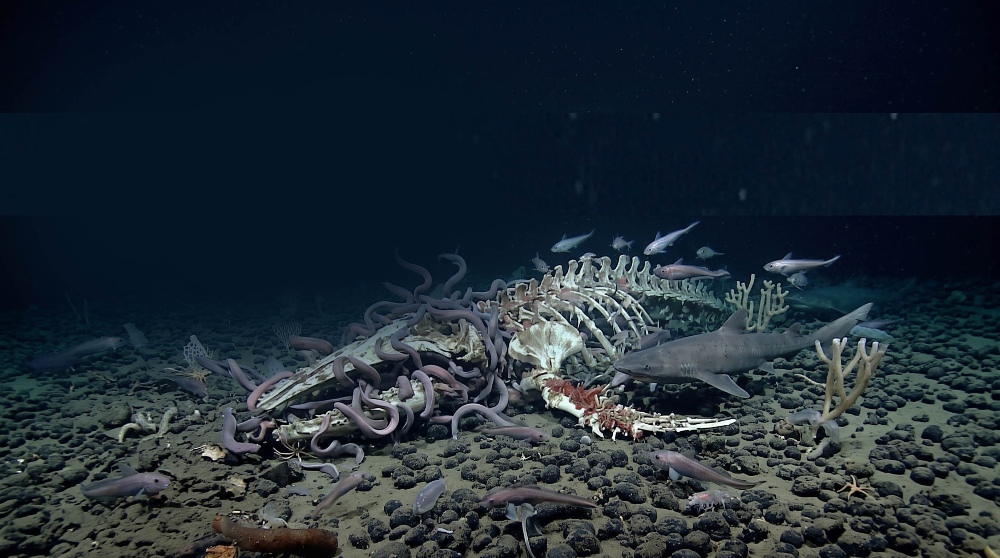

---
<!-- _class: structural -->
**Bedeutung als Mikro-Ökosystem:**
Der Kadaver wird zu einer regelrechten Oase des Lebens, die jahrzehntelang ein hochkomplexes, spezialisiertes Ökosystem aufrechterhält. Ein einziger Wal liefert schätzungsweise so viel Kohlenstoff, wie sonst in 2.000 Jahren auf diese Fläche des Meeresbodens "regnet".

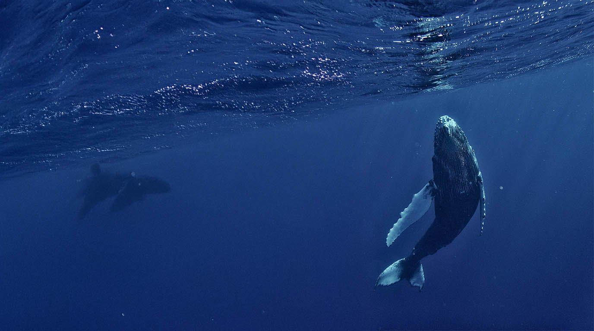

---

**Die drei Stadien der Zersetzung:**
  1. **Aasfresser-Stadium (Mobile-scavenger stage):** Haie, Schleimaale und Krebstiere fressen über Monate bis Jahre
  hinweg das weiche Gewebe in rasendem Tempo ab.
  2. **Anreicherungs-Stadium (Enrichment-opportunist stage):** Würmer und kleine Krebstiere besiedeln die Knochen und das umliegende, extrem nährstoffreiche Sediment, das von den organischen Resten durchtränkt ist.
  3. **Sulfophiles Stadium (Sulfophilic stage):** Kann Jahrzehnte andauern. Bakterien zersetzen die Fette im Inneren der
  gewaltigen Walknochen. Dabei entsteht Schwefelwasserstoff (ähnlich wie an Schwarzen Rauchern). Dieser dient als Energiequelle für hochspezialisierte chemosynthetische Lebewesen, etwa den Knochenfresser-Wurm (Osedax).
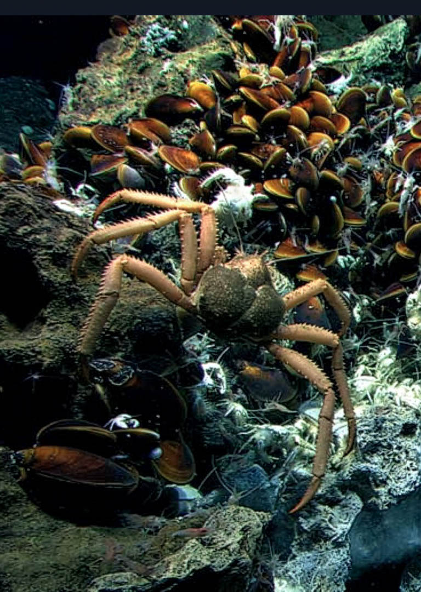

---
**Evolutionäre "Trittsteine" (Stepping Stones):**
Wissenschaftler vermuten, dass Whalefalls als evolutionäre Trittsteine fungieren, über die sich chemosynthetische Arten (die auch an heißen Quellen und Cold Seeps vorkommen) über weite Distanzen am Meeresboden ausbreiten können.
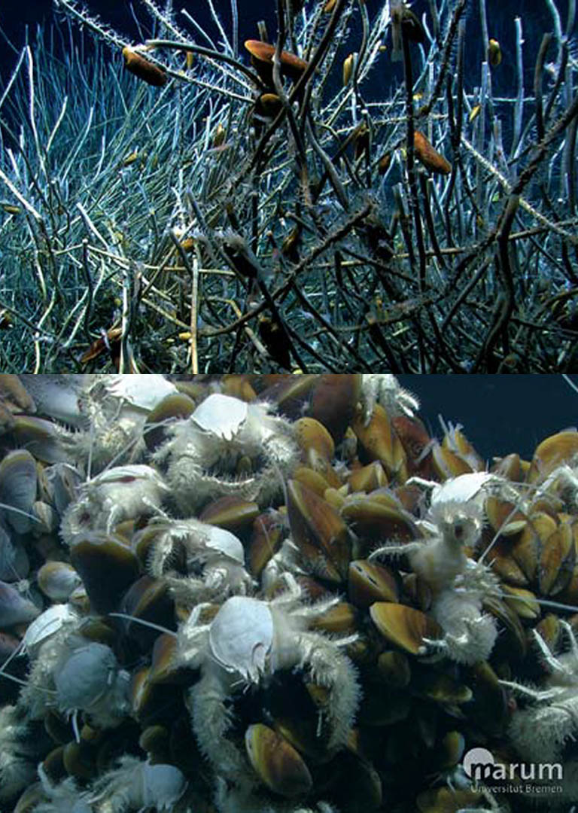

---
<!-- _class: structural -->
### Schlüsselstation Eisfischnester
**Sensationelle Entdeckung (AWI-Forschung):**
Im Jahr 2021 entdeckten Forscher des Alfred-Wegener-Instituts (AWI) mit dem Forschungsschiff *Polarstern* im antarktischen Weddellmeer die weltweit größte bekannte Fischbrutkolonie.
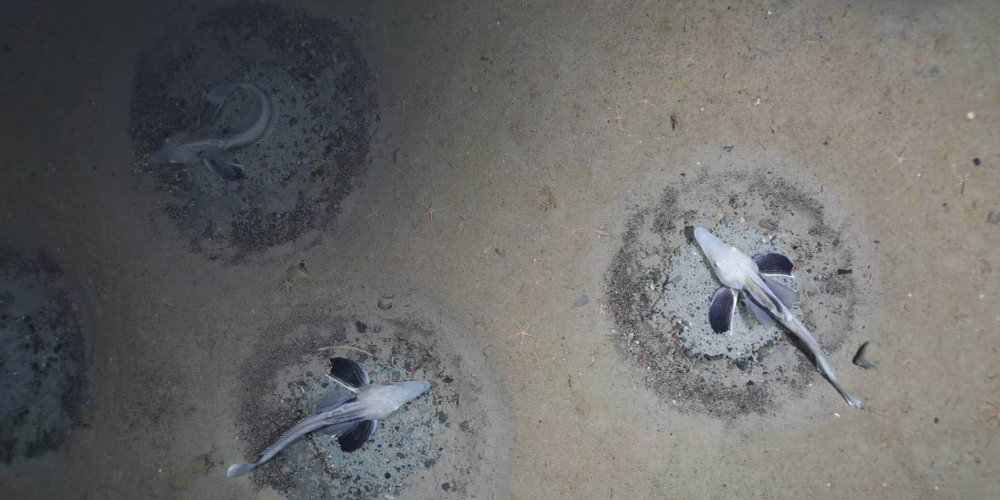

---
<!-- _class: structural -->
**Gigantisches Ausmaß:**
Die Kolonie der sogenannten Jonas-Eisfische (*Neopagetopsis ionah*) erstreckt sich über eine Fläche von ca. 240 Quadratkilometern und umfasst schätzungsweise 60 Millionen Nester.
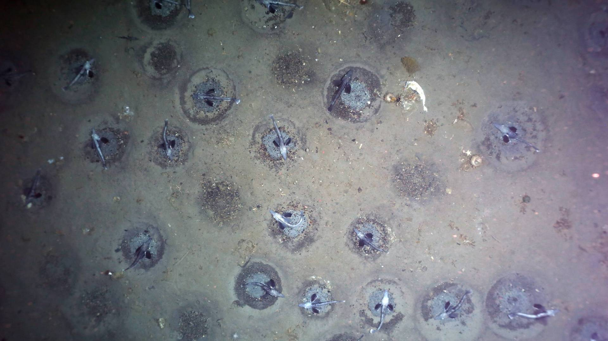

---
<!-- _class: structural -->
**Aufbau der Nester:**
Die Fische legen kreisrunde, kiesartige Mulden (ca. 75 cm Durchmesser, 15 cm tief) auf dem Meeresboden an. Jedes bebrütete Nest enthält im Durchschnitt über 1.500 Eier und wird in der Regel von einem erwachsenen Eisfisch aggressiv gegen Raubfische verteidigt.
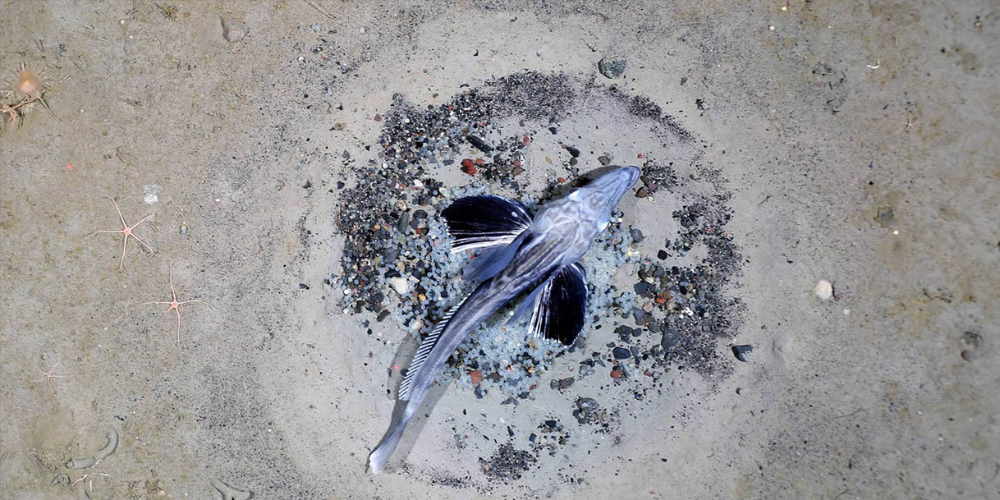

---
**Biologie der Eisfische:**
- Sie haben durchsichtiges Blut (ihnen fehlt das Hämoglobin), was eine Anpassung an das extrem kalte, sauerstoffreiche Wasser ist (Sauerstoff löst sich direkt im Blutplasma).
- Frostschutzproteine verhindern, dass ihr Blut bei den Temperaturen unter dem Gefrierpunkt gefriert.

---
<!-- _class: structural -->
**Ökologische Bedeutung:**
Diese gigantische Ansammlung von Biomasse (geschätzte 60.000 Tonnen) bildet einen Hotspot des Lebens im eisigen Südpolarmeer und dient beispielsweise Weddellrobben als riesiges "All-you-can-eat"-Buffet. Die Entdeckung unterstreicht, wie wenig wir über bestimmte marine Ökosysteme wissen und wie schützenswert sie sind.

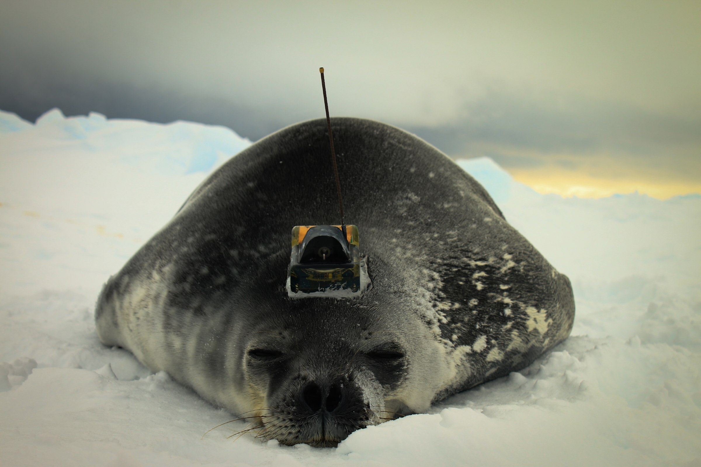

---
<!-- _class: structural -->
### Schlüsselstation Schwarze Raucher
**Was sind Schwarze Raucher?**
Schwarze Raucher sind hydrothermale Quellen, vulkanische Austritte am Meeresboden, meist in Tiefsee-Grabenbruchzonen (z.B. am Mittelatlantischen Rücken in 2.000 bis 3.000 Metern Tiefe).
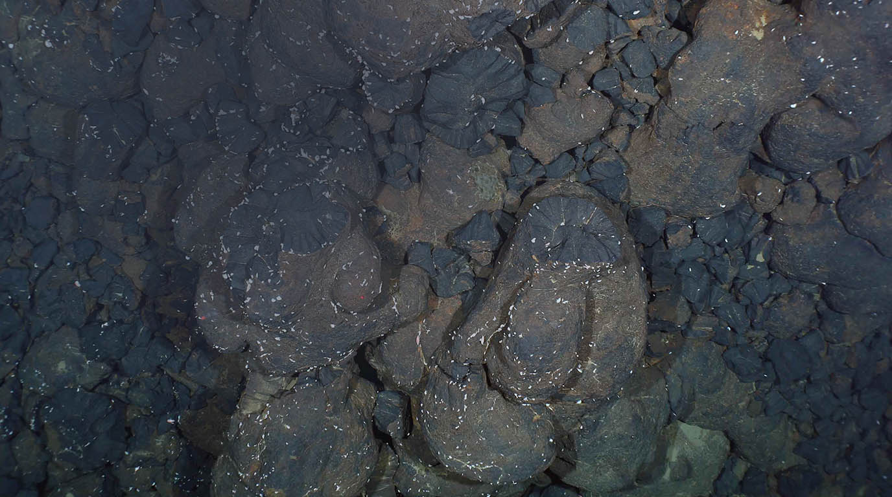

---
<!-- _class: structural -->
**Geologie und Chemie:**
Meerwasser sickert durch Risse im Meeresboden in die Kruste, wird in der Nähe von Magmakammern stark erhitzt (bis über 400 °C) und reichert sich mit Mineralien wie Eisen, Kupfer, Zink, Schwefelwasserstoff und Kohlendioxid an.

Von MARUM − Zentrum für Marine Umweltwissenschaften, Universität Bremen - MARUM, CC BY 4.0, https://commons.wikimedia.org/w/index.php?curid=76498971
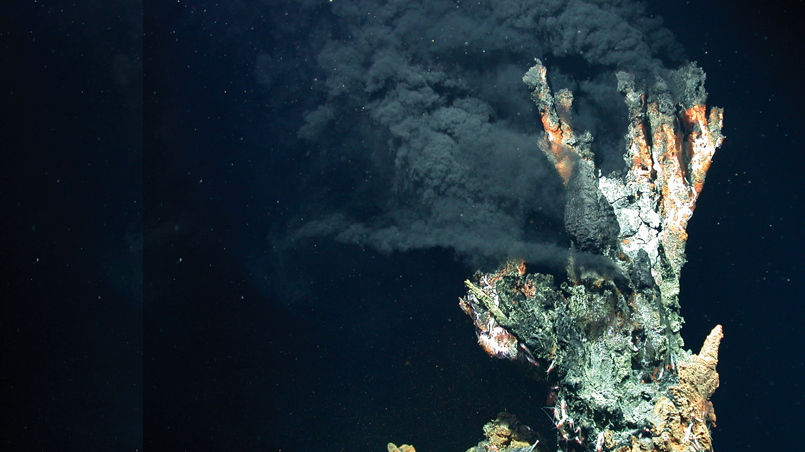

---
**Das Aussehen:**
Beim Kontakt mit dem kalten Tiefseewasser (ca. 2 °C) fallen die gelösten Metallsulfide aus und bilden hohe Schornsteine (oft mehrere Meter hoch) aus schwarzem Material. Dies ähnelt optisch dem Rauch von Schloten – daher der Name.
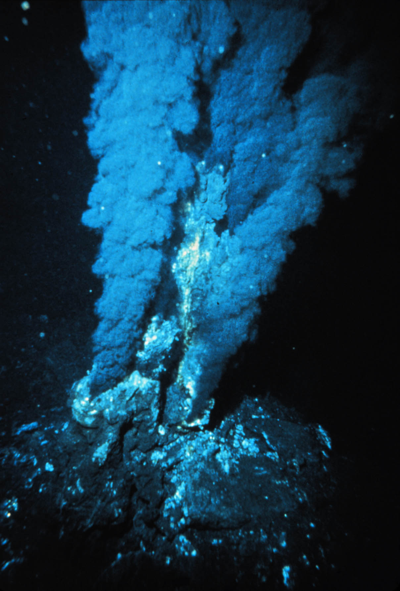

---
<!-- _class: structural -->
**Lebensgemeinschaften (Extremophile):**
Entgegen der Annahme, die Tiefsee sei arm an Leben, beherbergen Schwarze Raucher extrem artenreiche Lebensgemeinschaften.

Von MARUM − Zentrum für Marine Umweltwissenschaften, Universität Bremen - MARUM, CC BY 4.0, https://commons.wikimedia.org/w/index.php?curid=76498972
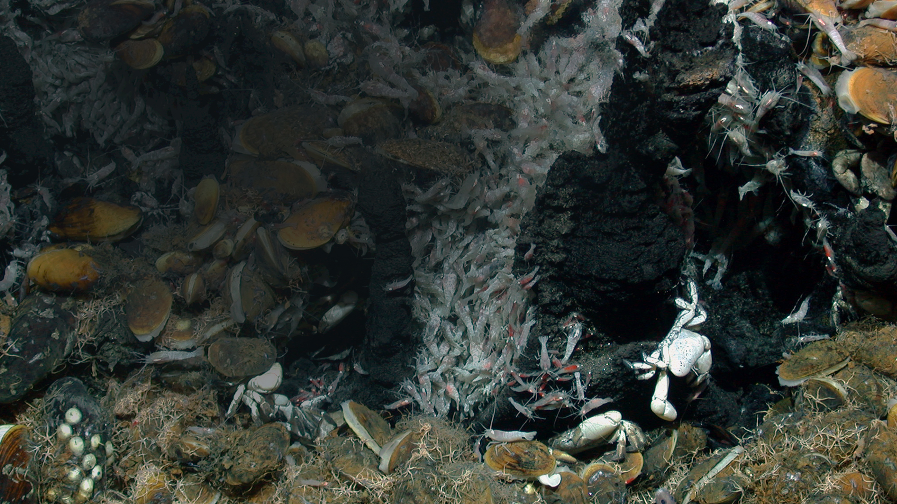

---
**Chemosynthese – Die Grundlage:**
Da kein Sonnenlicht hinkommt, produzieren spezialisierte Bakterien und Archaeen ihre Energie nicht durch Photosynthese, sondern durch **Chemosynthese**:
Sie oxidieren Schwefelwasserstoff (H₂S) aus den Quellen und wandeln chemische Energie in organische Substanz um.
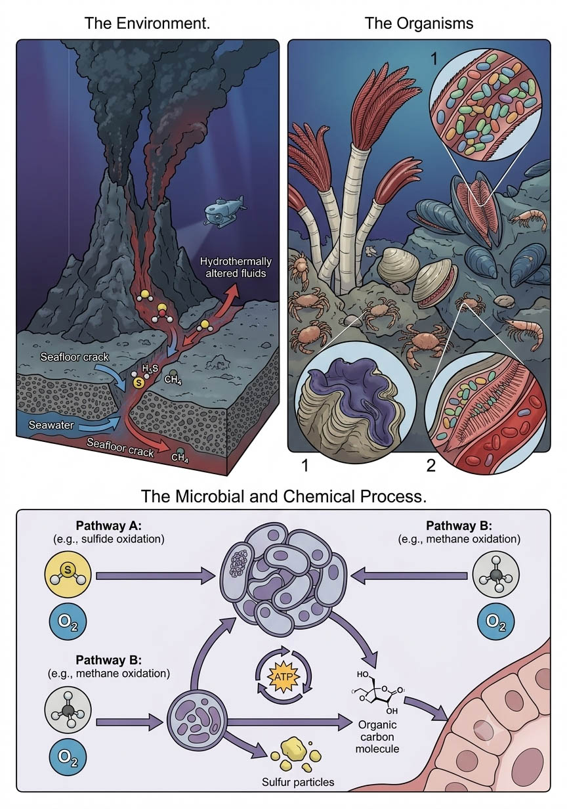

---
**Ernährungspyramide:**
- **Basis:** Chemosynthetische Mikroorganismen (Bakterien/Archaeen).
- **Primärkonsumenten:** Massive Kolonien von Röhrenwürmern
(z.B. *Riftia pachyptila*), die bis zu 2 Meter lang werden können.
Sie besitzen kein Verdauungssystem, sondern leben in
Symbiose mit den Bakterien in ihrem Inneren.
- **Sekundär:** Viele Muscheln, Schnecken, Garnelen
und wenige Fische.
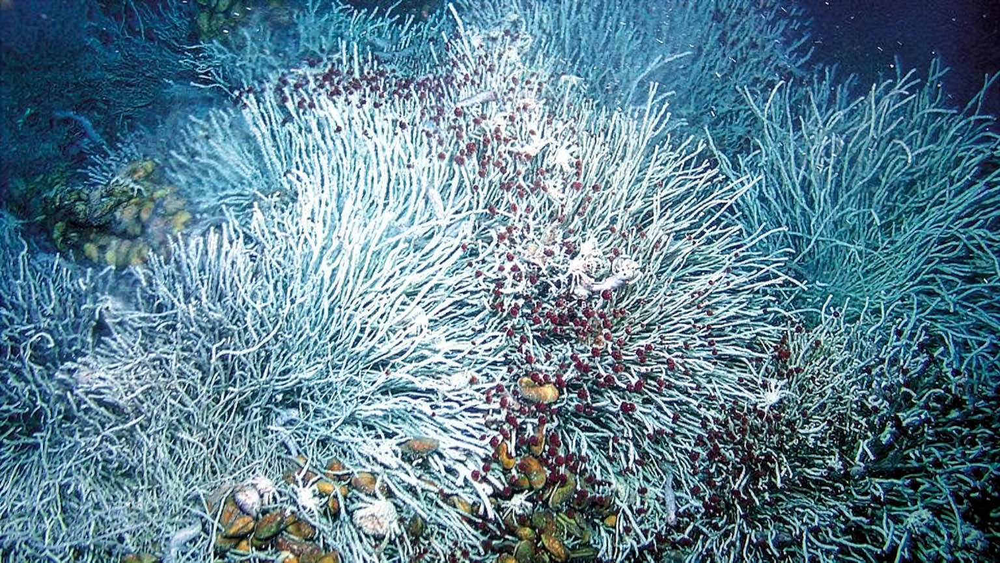

---
**Hotspot-Charakter:**
Schwarze Raucher sind marine "Oasen" in der riesigen Tiefsee-Wüste. Sie zeigen, dass Leben unter extremen Bedingungen (hoher Druck, Dunkelheit, giftige Chemikalien) möglich ist und sich unabhängig von Sonnenenergie entwickeln kann. Diese Entdeckung hat auch Auswirkungen auf die Suche nach extraterrestrischem Leben (z.B. auf Jupitermonden). 
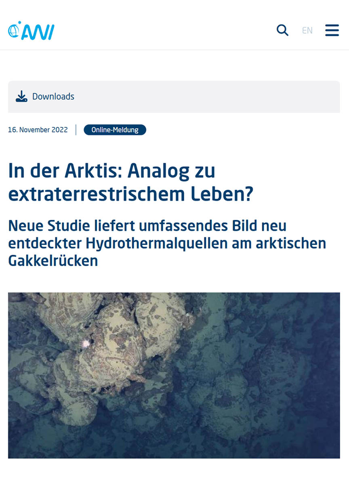

---
<!-- _class: kapitelende-->

---
<!-- _class: structural -->
# Gamification & Live-Feed-Gedanke

### Gamification
- das virtuelle Forschungsprojekt basiert auf
einer Spielemechanik
- es gibt lineare Abläufe (Abtauchen) & freie Entscheidungsmöglichkeiten (Steuern am Meeresboden)
- es ist eine Mission zu erfüllen (z.B. Daten sammeln,
Aufnahmen des Abbaus von Manganknollen machen,
Proben entnehmen)
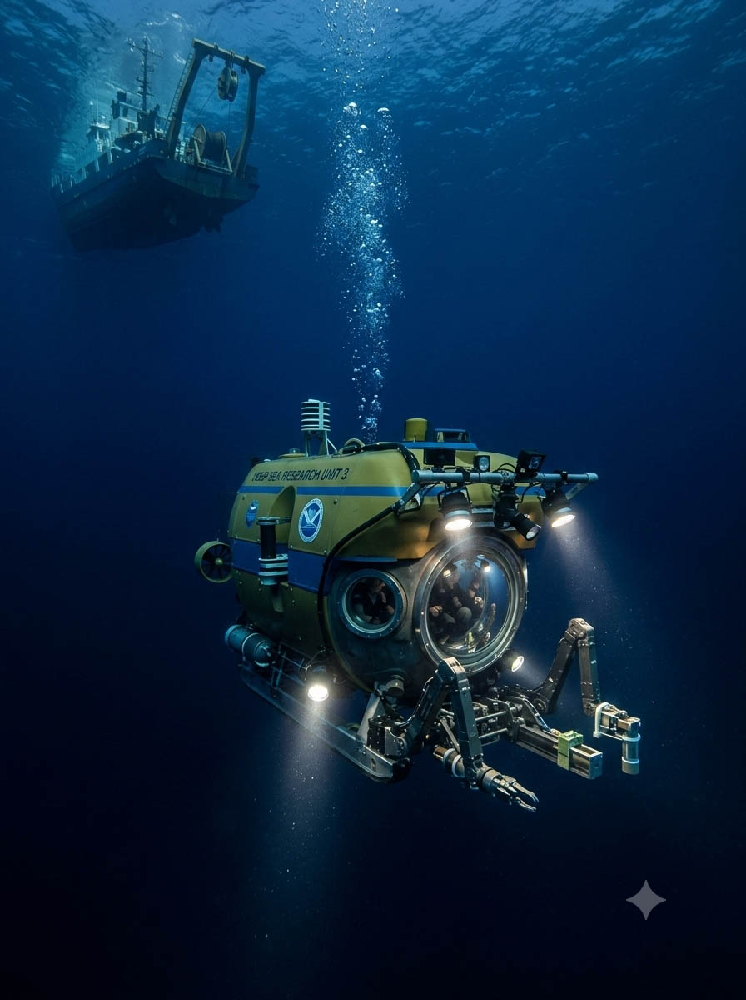

---

### Live-Feed-Gedanke
- der Ablauf wird von realen Personen live begleitet
- Während des Tauchgangs besteht auditiver
Kontakt zur Oberfläche
- Die Crew auf der Oberfläche gibt Informationen
und Kommandos
- es soll ein Gefühl von Nähe und Verbundenheit
zur Crew entstehen
- es werden regelmäßig Updates zu den
Zuschauerzahlen gegeben
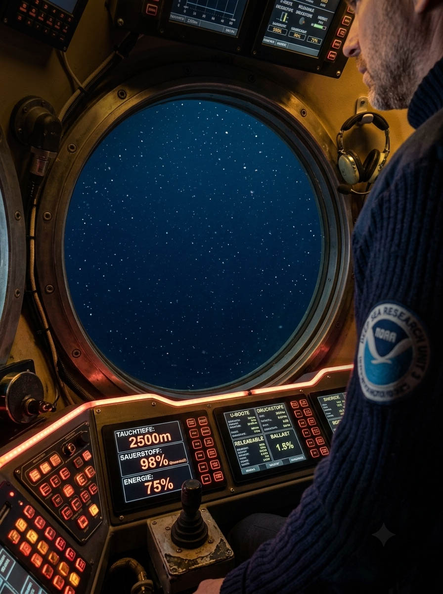

---

<!-- _class: kapitelende-->

---
<!-- _class: structural-->

# Exkursion nach Bremerhaven
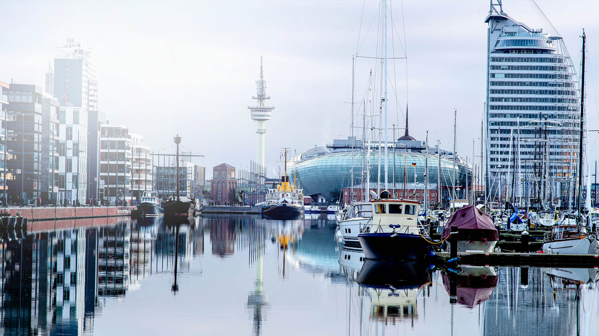

---
## Ziele der Exkursion
- Kennenlernen des AWI und seiner Arbeit im Bereich der Tiefseeforschung
- Dr. Frank Wenzhöfer, seine Ziele und Projekte
- Erwerb von Verständnis und Fachwissen in der Meeresforschung
- Liebe zum Meer entwickeln
- Teambildung
- Commitment auf ein gemeinsames Ziel
- Kennenlernen der Hafenstadt Bremerhaven
- Schnuppern von Seemannsluft, Fischerei-
und Hafenatmosphäre
- Identifikation und Besprechung gemeinsamer Forschungsanträge

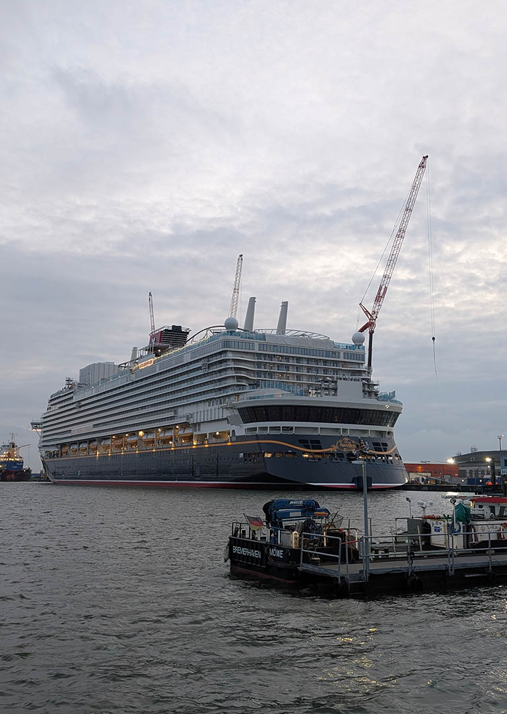

---
<!-- _class: structural -->
## Daten und Fakten

**Zeitraum**

12.10.2026 - 15.10.2026

**Teilnehmende**
- Stefan Sauer		Betreuer
- Florian Schuster	Betreuer
- Prof. Dr. Uwe Sponholz	Mitarbeiter
- Dominik Fritsch	Mitarbeiter
- Chris Haselhoff		Mitarbeiter
- 15 Studierende aus FKV und FIW
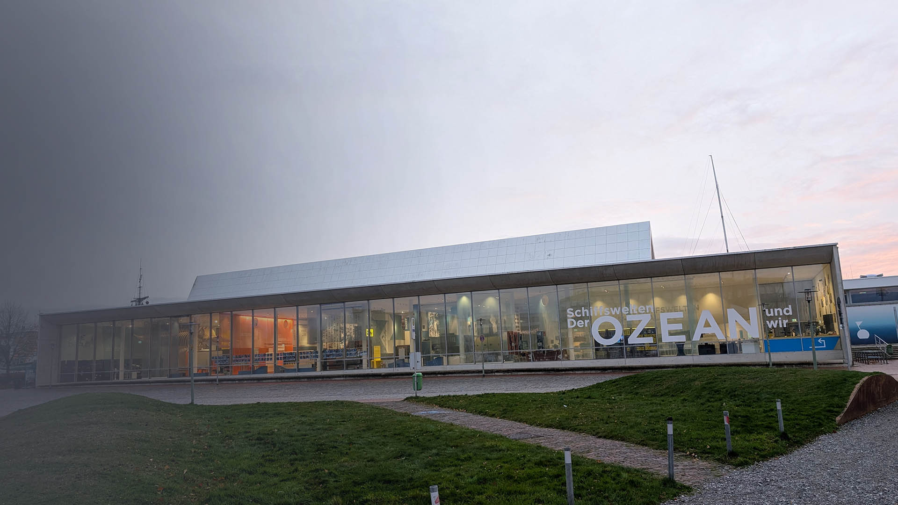

---
**Allgemeine Informationen**

- Wir werden in Bremerhaven auch viel zu Fuß unterwegs sein.
Achten Sie auf leichtes Gepäck, gutes Schuhwerk und
wetterfeste Kleidung.
- Ggf. Gummistiefel für Wattwanderung (können auch vor Ort geliehen werden)
- Es gilt Selbstversorgung während der Exkursion
- Die Fahrt erfolgt mit drei thws-Bussen
- Fahrtkosten, Übernachtungskosten und Museumseintritte
werden übernommen
- von den Studierenden ist vorab ein Eigenanteil zu leisten
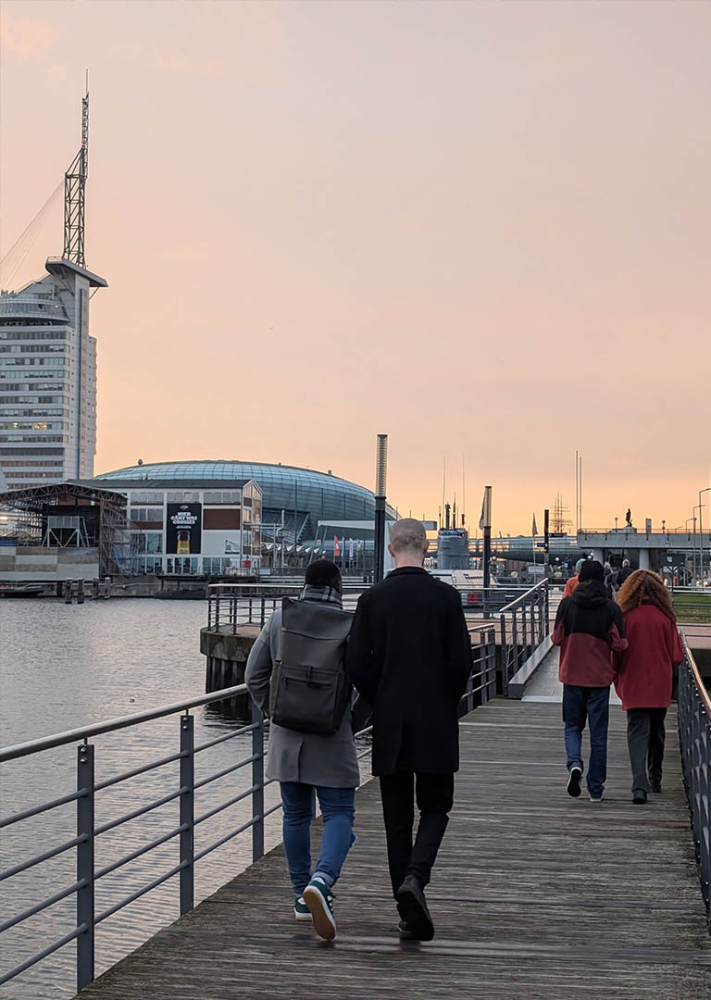

---
## Ablauf & Programm
### 12.10.2026
- Abfahrt ca. 7:00 Uhr in Würzburg
- Gegen Mittag Ankunft im Hotel
- Ab ca. 13:00 Uhr Besuch des
**U-Bootes Wilhelm Bauer**
https://uboot-wilhelm-bauer.de/
https://maps.app.goo.gl/rbNgqmpyVJQjgrxQA
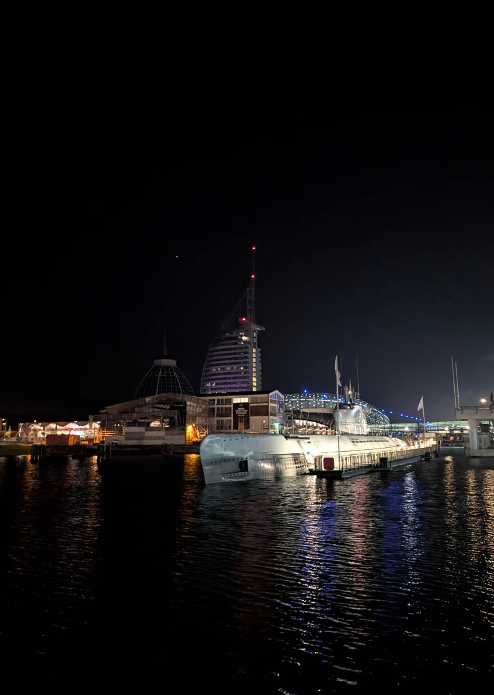

---
- Ab ca. 15:00 Uhr Besuch des
**Deutschen Schifffahrtsmuseums**
https://www.dsm.museum/
https://maps.app.goo.gl/4C6eiC8w8eoTa8MMA
- Zurück zum Hotel
- gemeinsames Abendessen und Diskussionen
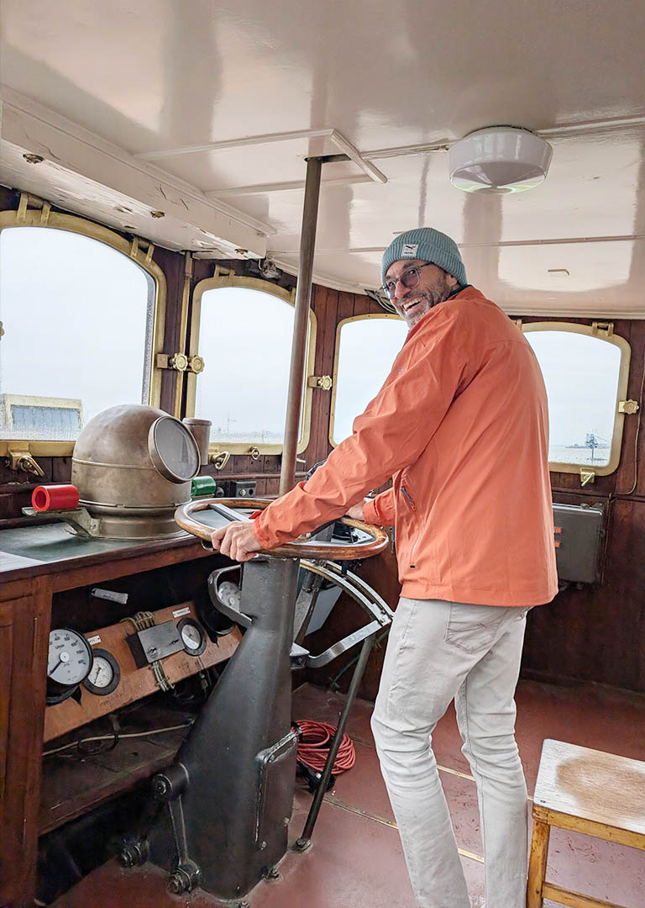

---
### 13.10.2026
- Ab 10:00 Uhr Besuch des Alfred-Wegener-Instituts
- Organisation durch Frank Wenzhöfer
- Führung durch das Institut
- Gesprächsrunde mit Dr. Frank Wenzhöfer
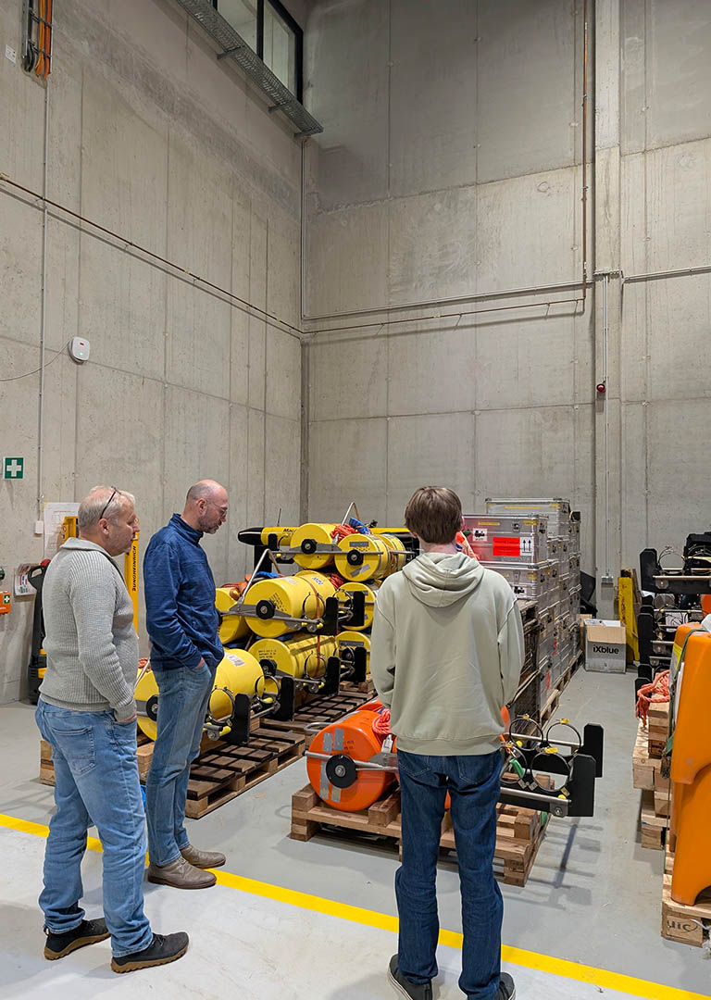

---
<!-- _class: structural-->
- Danach Besuch des „Schaufenster Fischereihafen“? (Alternativvorschläge möglich)
https://www.schaufenster-fischereihafen.de/
https://maps.app.goo.gl/aWH4weTZG5DH9d8i6
Fußläufig vom AWI 35 min.
- Alternativ z.B. https://fischbahnhof360.de/ (Kosten 3€ pro Person, Selbstzahlung)
Sieht nach einem tollen 360° Erlebnis aus!
- Ausklang bei gemeinsamen Abendessen und Diskussionen
Essen am Fischereihafen
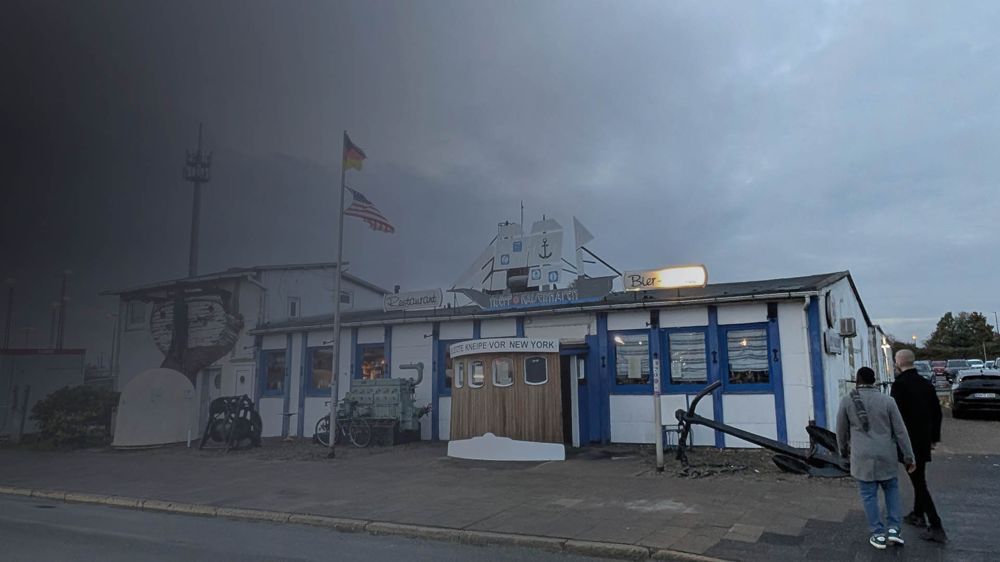

---

### 14.10.2026

- Ab 10:00 Uhr Besuch des 
**„Zentrum für Umweltforschung und Umwelttechnologie“**
Leobener Str. 6, 28359 Bremen-Horn-Lehen
https://www.uni-bremen.de/uft
- Danach Wattwanderung:
https://www.nationalpark-wattenmeer.de/
https://maps.app.goo.gl/5p9jTq9Bv5Bv5Bv5A
Treffpunkt nach Absprache
(abhängig von Wetter und Gezeiten)
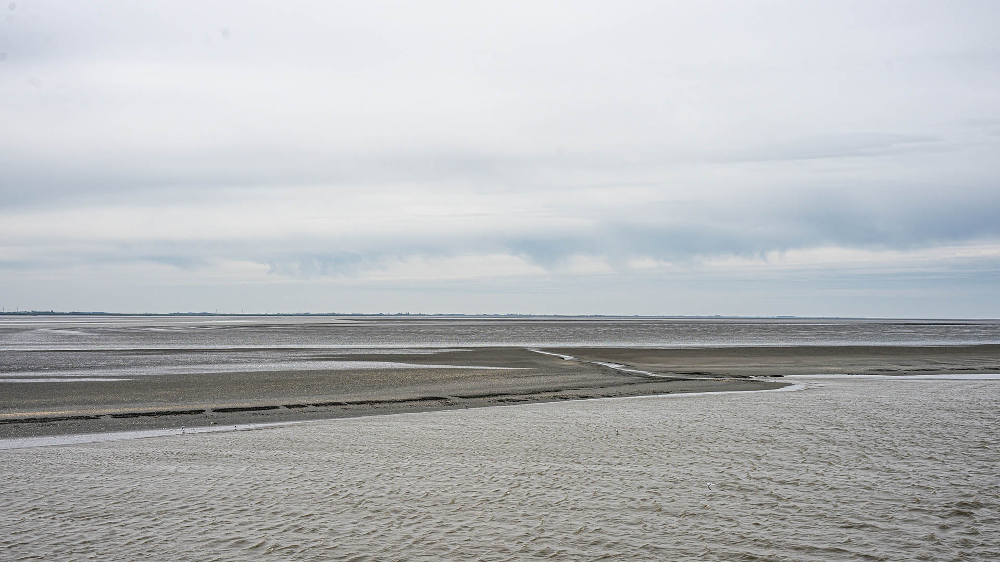

---
### 15.10.2026
- Ab 10:00 Uhr Besuch des
**Klimahaus Bremerhaven**
https://www.klimahaus-bremerhaven.de/
https://maps.app.goo.gl/dGWS9cHXUUye56QQ7
- Abreise ca. 13:00 Uhr
- Ankunft in Würzburg gegen Abend
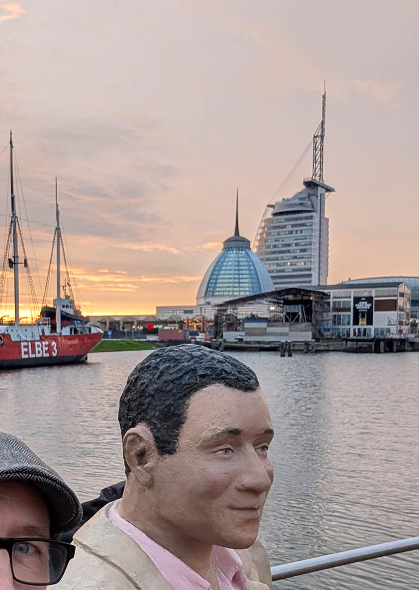

---
<!-- _class: structural-->
## Arbeitsaufträge für die Exkursionsphase
- Team-Zuordnung
- Commitment auf eine gemeinsame Story
- Verständnis für die Einzelaufgaben entwickeln
- Kennenlernen der Betreuer und Mitarbeiter des MAVEL-Lab
- Sichtung der bereits erstellten Assets
- Gezielte Nachfragen an Dr. Frank Wenzhöfer, Notizen anfertigen und zusammentragen

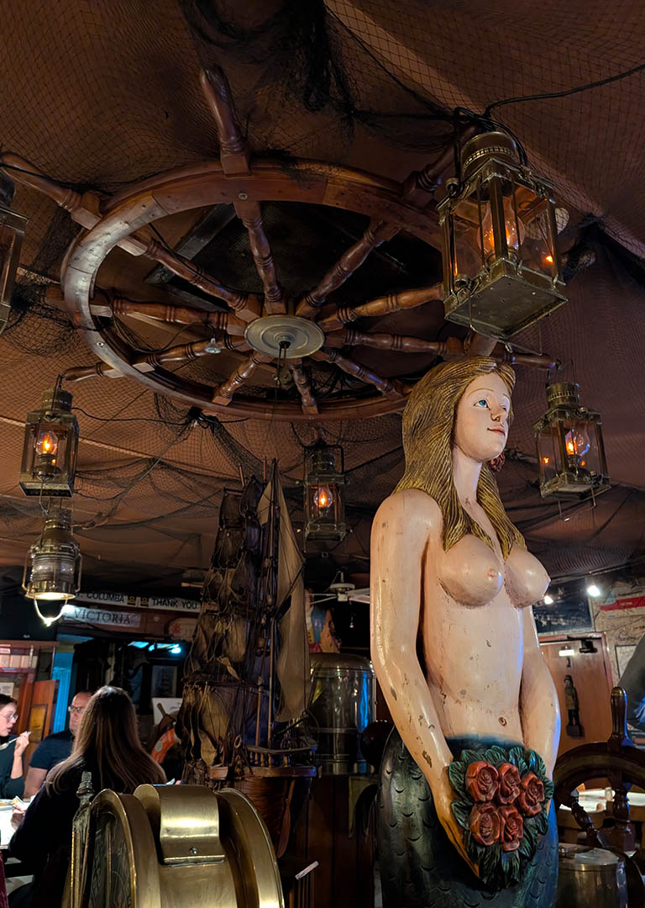

---

<!-- _class: kapitelende-->
---
<!-- _class: structural -->
# Organisation & Ablauf

---
<!-- _class: vielText -->
## Terminplanung (Semesterübersicht)
| Nr. | Datum | Uhrzeit | Status / Anmerkung |
| :--- | :--- | :--- | :--- |
| 01 | **07.10.2026** | 13:30-16:00 | Kickoff in Schweinfurt |
| 02 | **08.10.2026** | 12:30-16:00 | Vorbereitung Exkursion |
| 03 | **12. - 15.10.2026** | ganztägig | Exkursion Bremerhaven |
| - | **21.10.2026** | ganztägig | *Campusday - vorlesungsfrei* |
| 04 | **28.10.2026** | 12:30-16:00 | Einführung in Unreal von Dominik Fritsch |
| 05 | **04.11.2026** | 12:30-16:00 | Regulärer Termin |
| 06 | **11.11.2026** | 12:30-16:00 | Regulärer Termin |
| - | **18.11.2026** | 12:30-16:00 | Regulärer Termin |
| 07 | **25.11.2026** | 12:30-16:00 | Regulärer Termin |
---
<!-- _class: vielText -->
| Nr. | Datum | Uhrzeit | Status / Anmerkung |
| :--- | :--- | :--- | :--- |
| 08 | **02.12.2026** | 13:30 - 16:00| Zwischenpräsentation in Schweinfurt |
| 09 | **09.12.2026** | 12:30-16:00 | Regulärer Termin |
| 10 | **16.12.2026** | 12:30-16:00 | Regulärer Termin |
| 11 | **23.12.2026** | 12:30-16:00 | Regulärer Termin |
| — | *30.12.2026* | *Entfällt (Weihnachtspause)* |
| — | *06.01.2027* | *Entfällt (Weihnachtspause)* |
| 12 | **13.01.2027** | 12:30-16:00 | Bugfixing / Implementierung Finaler Daten |
| 13 | **20.01.2027** | 13:30-16:00 | Endpräsentation in Schweinfurt |
---

## Prüfungs- und Bewertungskriterien

Das Projekt wird über die Software Confluence administriert und protokolliert.
https://vr-lab.atlassian.net/wiki/spaces/PG/pages/3016785921/Tiefsee-2026-27

Jeder Kursteilnehmende hat ein Protokoll über die eigene Arbeitsleistung zu erstellen. Neben den tatsächlich erstellten Artefakten
fließen die protokollierten Leistungen in die Benotung ein.
Im Confluence-System ist eine Seitenstruktur vorhanden, die für das Protokoll genutzt werden kann.
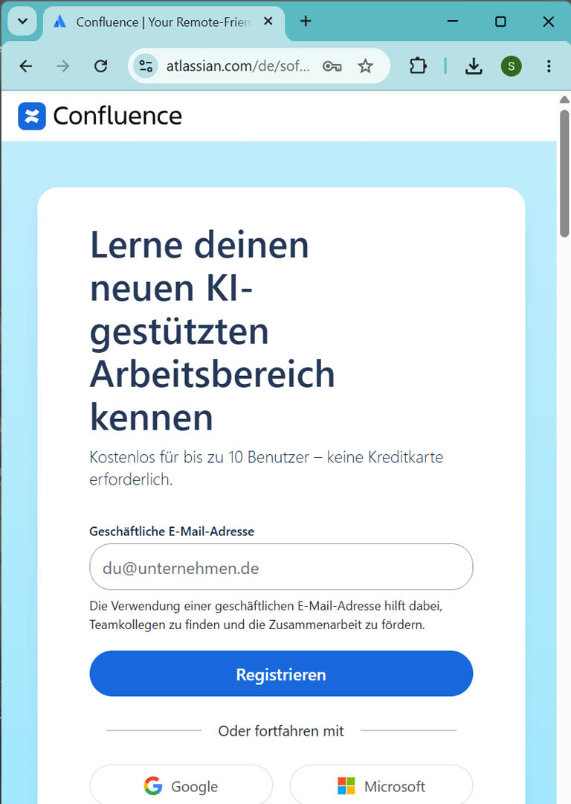

---
### Endpräsentationen

Neben der Präsentation der Endanwendung ist von jedem Teilnehmenden ein Kurzreferat über 5 Minuten über die eigene Arbeitsleistung zu halten.
Als Basis der Präsentation dient das Confluence-Protokoll.
Das Referat ist als pdf abzugeben und geht in die Bewertung ein.

---
### Bewertungskriterien
- Umfang der erbrachten Leistungen für das Team (Artefakte)
- Darstellung der Arbeitsleistung im Protokoll
- Qualität der Artefakte
- Gesamtprojektleistung
- Endpräsentation der eigenen Leistung
- Qualität der Endpräsentation

---
<!-- _class: structural -->
### Abgabeleistungen
- Alle erstellten Artefakte / Assets
- Projekttagebuch in Confluence und als pdf-Export
- Kurzreferat über die eigene Leistung als pdf-Export

---

## Betreuungskonzept

Der Kurs wird durch Stefan Sauer und Florian Schuster betreut. Dominik Fritsch steht als Ansprechpartner für technische Fragen zur Verfügung.

---

### Betreuende Personen

**Stefan Sauer**

Aufgaben:
- Kurskoordination
- Inhaltliche Gesamtsteuerung und Entwicklung der Narrative
- Kontakt und Koordination mit dem AWI und Dr. Frank Wenzhöfer
- Entwicklung und Koordination der wissenschaftlichen Story
- Moderation des gesamten Projektverlaufs
- Vermittlung zwischen den Teams und Sicherstellung der Kommunikation und Kooperation
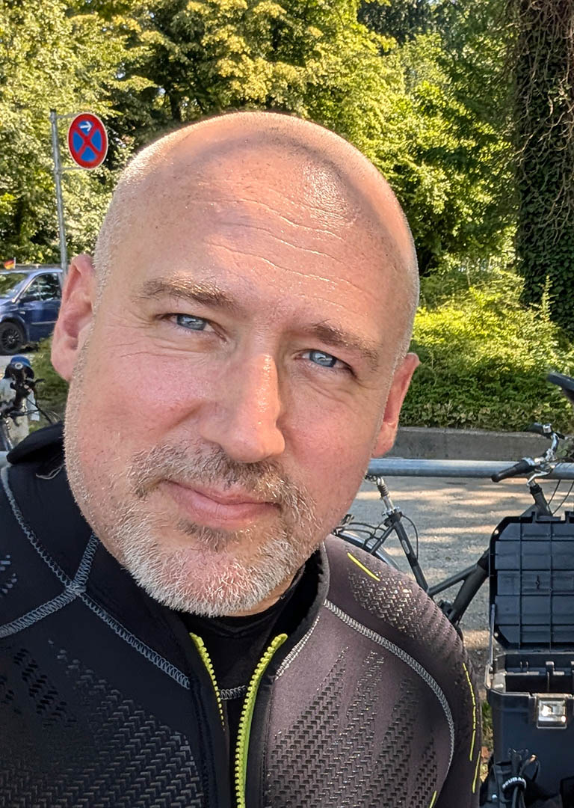
---

Kompetenzen:
- 3ds max / AutoCAD / Unreal
- Erstellen von texturierten 3D-Modellen
- Erstellen von Animationen
- Look & Feel als Taucher
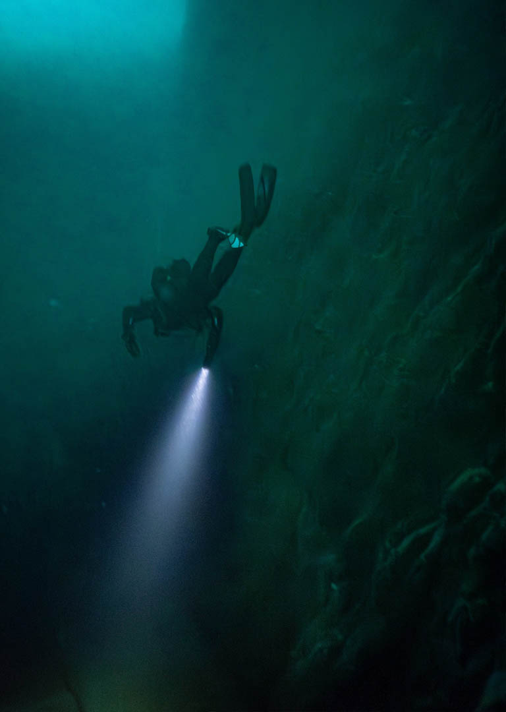
---

**Florian Schuster**

Aufgaben:
- Kurskoordination
- Ansprechpartner für koordinatorische Fragen
- Exkursionsorganisator
- Betreuung des U-Boot-Baus
- Vermittlung zwischen den Teams
und Sicherstellung der Kommunikation und Kooperation

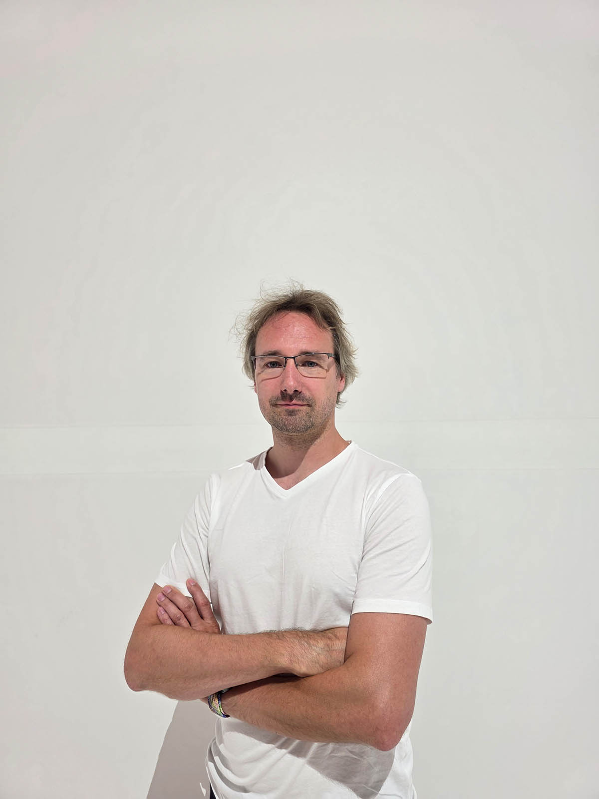

---

Kompetenzen:
- Software-Tools zur Organisation und Datenaustausch
- Physischer Bau des U-Bootes
- Workflow-Optimierung (Team-übergreifend)
- Vermittler zwischen den Fakultäten
- Erfahrungen in und Spaß an der Lehre

---

**Dominik Fritsch**

Aufgaben:
- Technical Lead
- Betreuung der Cave
- Programmierung und Shading
- Unterstützung bei der Story

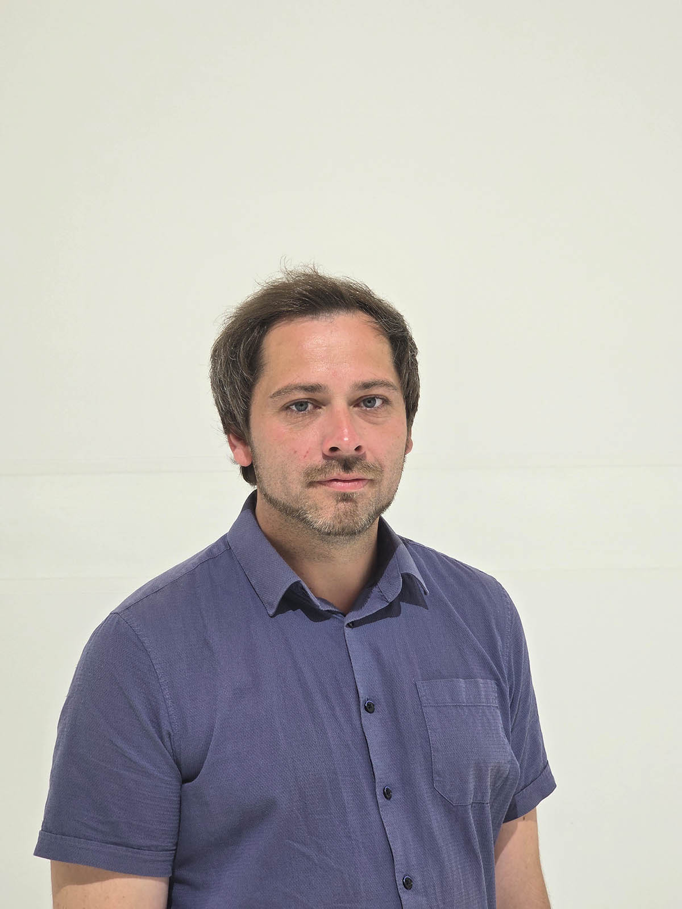

---

Kompetenzen:
- Unreal Engine-Experte
- Virtual Production
- Game-Design
- Technische Unterstützung bei Problemen mit den Tools der Teams
- Organisation und Durchführung von Workshops
- Erfahrungen in der Lehre (Softwaretraining)

---

**Chris Haselhoff**

Aufgaben:
- Physischer Bau des U-Bootes
- Material- und Technik-Beschaffung
- Koordination des U-Boot-Teams

Kompetenzen:
- handwerkliche Realisierung
- Holz- / Metallbearbeitung
- Umgang mit Werkzeugen
- Beschaffung von Werkzeugen und Materialien

---

**Prof. Dr. Uwe Sponholz**

Aufgaben:
- Inspiration und Storytelling
- Forschung und Inhaltliche Unterstützung
- Gesamtinszenierung
- Unterstützung in der Benotung

Kompetenzen:
- Projektmanagement
- Teambildung
- Konfliktlösung
- Inspiration
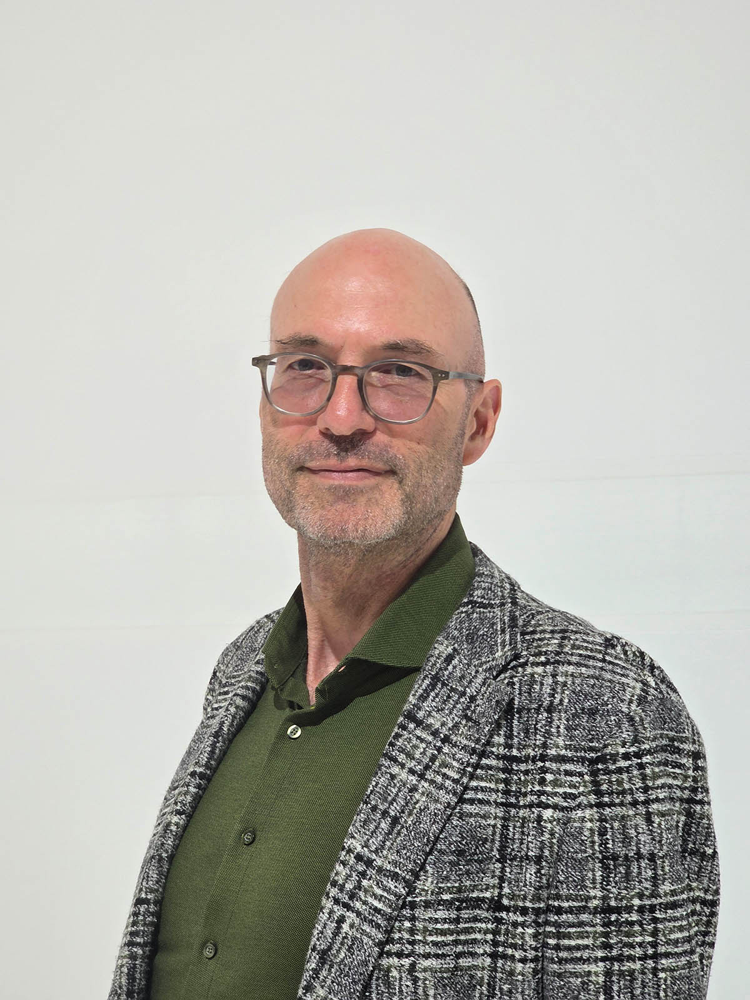

---

<!-- _class: kapitelende-->
---

# Interdisziplinäre Teamstruktur & Aufgabenverteilung

- Die Studierenden verteilen sich auf 7 Teams (1 - 4 Pax)
- Interdisziplinäre Besetzung, d.h. Zusammensetzung aus Studierenden unterschiedlicher Studiengänge.
- Die Zuordnung zum Team erfolgt eigenständig
- Interesse und Freude am Kompetenzerwerb als Zielsetzung bei der Teamauswahl
- Die Teambildung sollte nach der Exkursion abgeschlossen sein.
- Im Zweifelsfall entscheidet die Projektleitung über die Team-Zugehörigkeit.

---
<!-- _class: structural -->
## Team-Übersicht
**Team 1** - Leitung und Orga (max. 2 Pax)

**Team 2** - Physischer Bau (max. 2 Pax)

**Team 3** - Hardware-Interaktion & Elektronik (max. 2 Pax)

**Team 4** - UI/UX & Sounddesign (max. 2 Pax)

**Team 5** - Engine-Programmierung (max. 1 Pax)

**Team 6** - Level Design (min. 2 Pax, max. 4 Pax)

**Team 7** - VFX (min. 2 Pax, max. 4 Pax)

---

### Team 1 - Leitung und Orga
 max. 2 Personen aus FKV & FIW

 Dieses Team ist für die übergreifende Koordination und Kommunikation verantwortlich.

Aufgaben:
- kümmert sich um die Belange aller Teams
- Kommunikation nach außen zu AWI und thws
- Kommunikation innerhalb der Teams
- Dokumentationen in Confluence
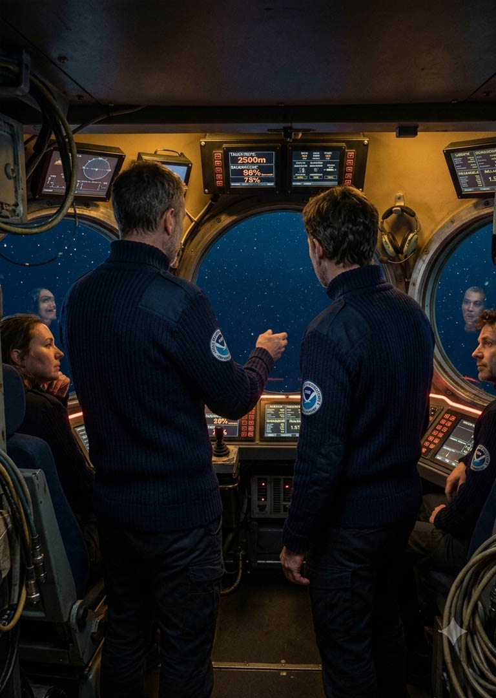
---

- Pflege der Gesamtdokumentation, Aufforderung zu Einzeldokumentationen
- Erstellen einer finalen Plakatpräsentation
- Verteilung und Überwachung der Bearbeitung der Einzelaufgaben
- Organisation wöchentlicher Standup-Meetings
- Report von aktuellem Stand, Problemen und Lösungen
- Pflege der Gesamtanwendung in Unreal, Datensparsamkeit, Bereinigung
- Versionierung und Sicherung
- Kommunikation der Schnittstellen (Arduino / Gamecontroller)

---
### Team 2 - Physischer Bau 
max. 2 Personen aus FKV & FIW

Dieses Team ist für die haptische Ebene in der CAVE zuständig. Sie bauen das reale Mock-up, in dem die User später sitzen.

Aufgaben:
- Mock-up Konstruktion: Entwurf und Bau des eiförmigen, engen "Raums im Raum" aus dunklen Holzlatten ("Eigenbau"-Ästhetik).
- Ergonomie & Interieur: Fertigung und Montage der zwei harten, unbequemen Sitze im Inneren des Bootes.
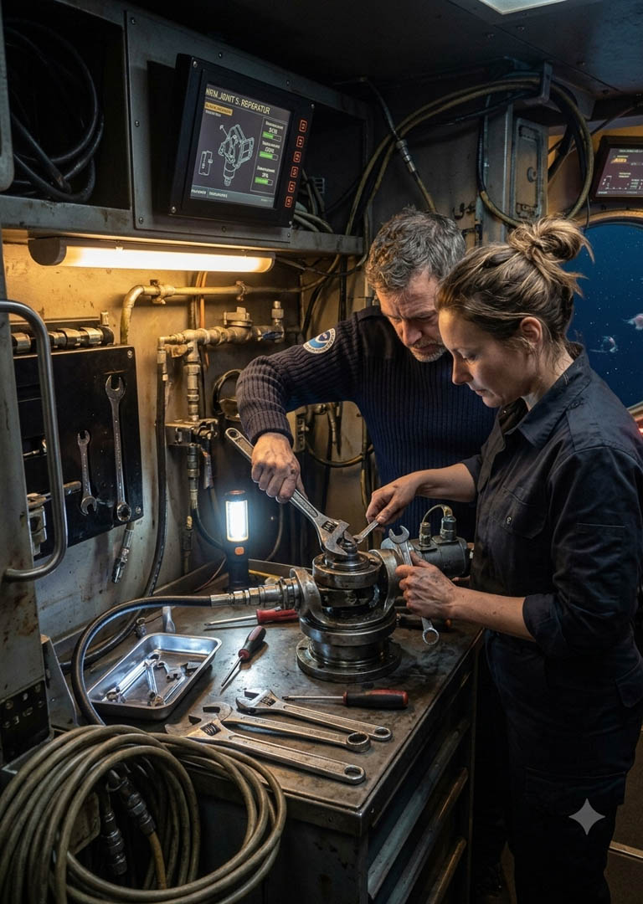

---

- Einstieg: Konstruktion der zwei stabilen physischen Stufen zum Überwinden der Einstiegskante.
- Schnittstelle zur CAVE: Ausmessen und Ausschneiden der Bullaugen. Optimale Wahrnehmung der Cave.
- Konsolen-Gehäuse: Bau der physischen Mittelkonsole mit Aussparungen für das Display, die Schalter und die Flight-Simulator-Steuereinheiten (Joystick & Schubregler).

---

### Team 3 - Hardware-Interaktion & Elektronik
max. 2 Personen aus FKV & FIW
Dieses Team schlägt die Brücke zwischen der physischen Kiste und der virtuellen Engine (z.B. Unreal Engine, Arduino).

Aufgaben:
- Feedback-Ausgabe Sauerstoff-, Energie-Überwachung,
 Meldung Kommunikation mit Boot
- Regler-Logik: Integration des Schubreglers zum analogen physischen Dimmen der Außenlichter in Unreal.
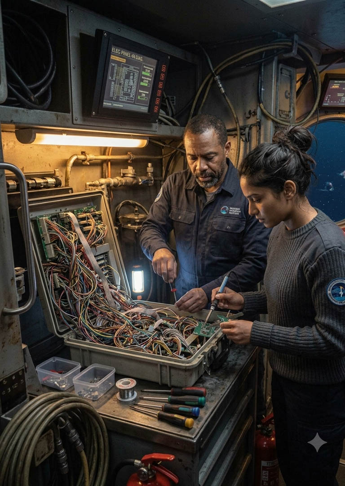

---

- Feedback-Beleuchtung: Installation und Programmierung der dunkelrot schimmernden LED-Streifen im Innenraum des Bootes sowie der Tastenbeleuchtung, steuerbar durch physischen Taster.
- Schnittstellen-Übergabe: Bereitstellung der Schaltsignale (Licht an/aus, Werte des Dimmers, Knopfdruck für Kamera-Aufnahme) als Input-Events für das Engine-Team.
- Taster zur Kommunikation mit dem Expeditionsboot

---

### Team 4 - UI/UX & Sounddesign
max. 2 Personen aus FKV & FIW

Dieses Team bespielt das physische Display im Boot und sorgt für die akustische Immersion im gesamten CAVE-Raum.

Aufgaben:

- Missions-Display (UI):
Design der Sci-Fi-Unterwasserkarte (2D-Grafiken für die Zielregionen: Manganknollen, Whalefall, Eisfischnester,
Schwarze Raucher).
- Erstellung des "No Signal / Rauschen"-Zustands
zu Beginn der Fahrt.
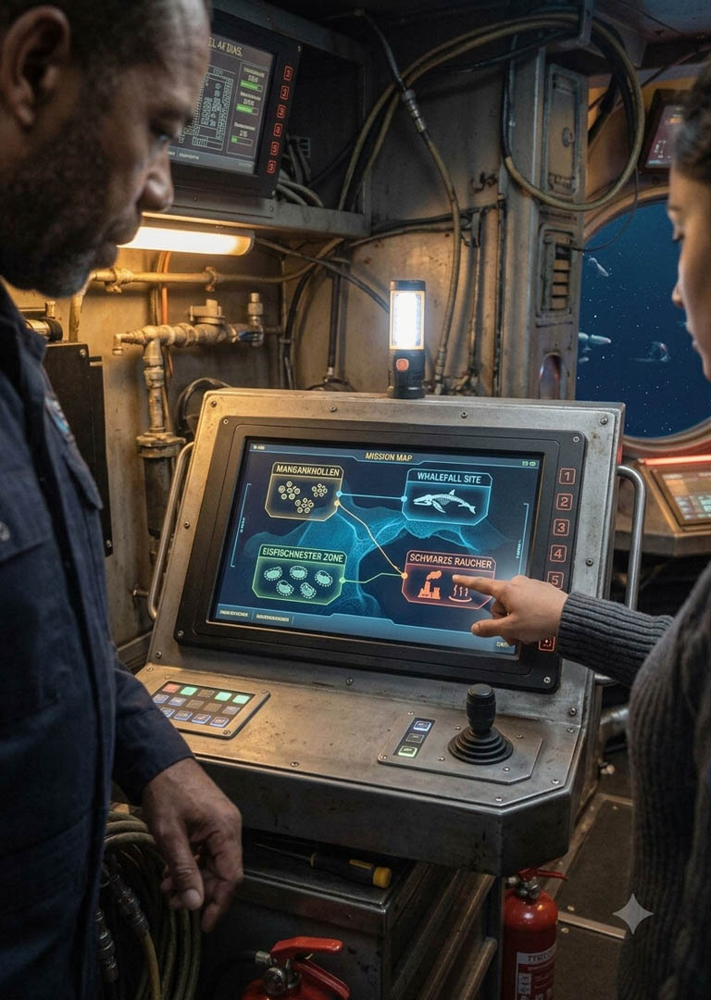

---

- Entwicklung der dynamischen Text- und Zahlenelemente (Tiefenanzeige bis 4053m, rasant steigender Zuschauer-Counter von 53.000 bis 453.000, "White House Live Feed"-Eilmeldung).
- Sounddesign Oberfläche: Meeresrauschen, Wind/Brise, Möwengeschrei, Signalhorn...
- Sounddesign Tiefsee: Fahrgeräusche, Funksprüche der "Polarstern", Klacken beim Einschalten der Scheinwerfer
- Walgesänge in der finalen Dunkelheit
- uvm...

---

### Team 5 - Engine-Programmierung

max. 1 Person

Das technische Rückgrat der virtuellen Welt. Sie verwalten die Physik, das CAVE-Setup und das Level-Streaming.

Aufgaben:
- U-Boot-Physik & Logik: Implementierung einer sehr trägen, massereichen Fahrzeug-Physik.
- Verknüpfung der Arduino- und USB-Inputs (Joystick, Throttle, Lichtschalter, Dimmer) mit den virtuellen Funktionen im Level.
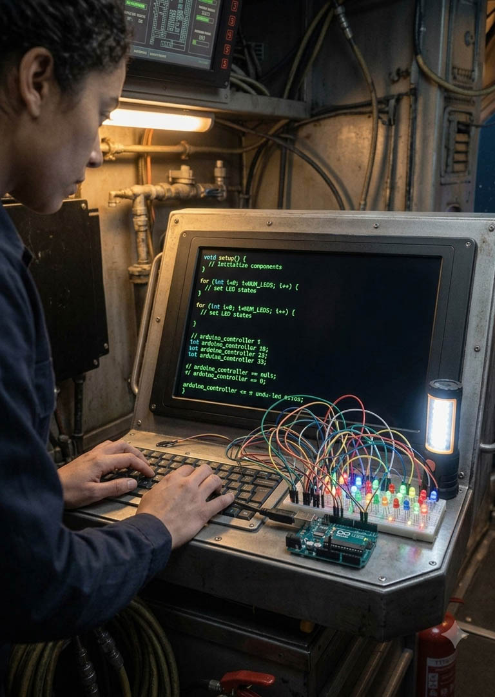

---

- Kamera- & Szenen-Animation: Programmierung des sanften Schaukelns an der Oberfläche.
- Vertikale Absenk-Animation (Kran-Simulation) beim Übergang unter Wasser.
- "On-Rails"-Steuerung für den Ab- und Aufstieg; Freischaltung der interaktiven Steuerung bei exakt 4000m Tiefe.

---

### Team 6 - Level Design 

Min. 2 Personen, max. 4 Personen aus FKV & FIW

Das Team erstellt die visuellen Highlights unter Wasser und erstellt die visuell ansprechenden Szenen.

Aufgaben: 

Level-Design & Landschaft:
Aufbau des tristen, schlammigen Meeresbodens (Displacement Meshes) mit dem Übergang in eine schroffere, felsige Basalt-Landschaft bei den Schwarzen Rauchern.
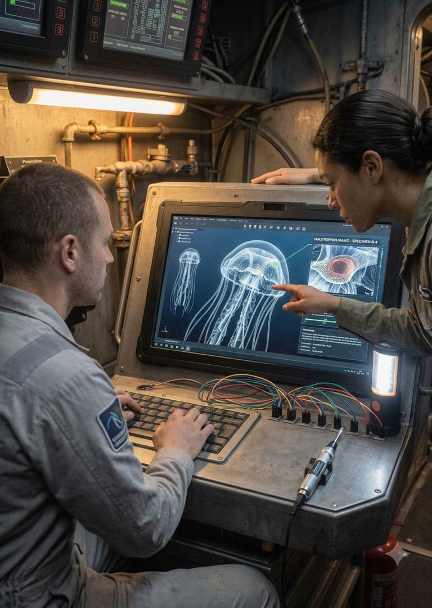

---

- Oberfläche / Expeditionsboot
- Begegnungen beim Ab-/ Auftauchen
- Whalefall Must-have
- Eisfischnester
- Manganknollenfeld Must-have
- Schwarze Raucher Must-have

---

3D-Assets & Animationen (Kreaturen & Maschinen):
- Sichten, testen und Bewerten der Assets aus dem Projekt 2025-26
- Entwicklung / Aufbereitung eines Forschungsschiffes (Polarstern)
- Integration animierter Lebewesen in Unreal
- Modellierung und Animation des raupengetriebenen Abbaufahrzeugs (rotierende Walzen).
- Riesiges, detailreiches 3D-Modell eines Walskeletts (Whalefall) inklusive kriechender Klein-Partikel (Würmer).

---

- 3D-Modell des Eisfisches (transparent/bleich schimmernd) und Platzierung der Bodennester (Kuhlen mit semitransparenten Eiern und schwarzem Punkt).
- Biomorph-fantastisches Tiefseewesen mit einem pulsierenden, bunten Biolumineszenz-Shader (Emissive-Material-Cycle).

---

### Team 7 - VFX
(Min. 2 Personen, max. 4 Personen aus FKV & FIW)
Dieses Team macht die Welt durch Shader, Effekte und Lebewesen lebendig und visuell packend.

Skybox & Beleuchtung:
- Erstellung der 360°-Oberflächen-Skybox (Sonne, unendlicher Horizont) inklusive Blendeffekt (Lens Flare / Bloom) beim Start.
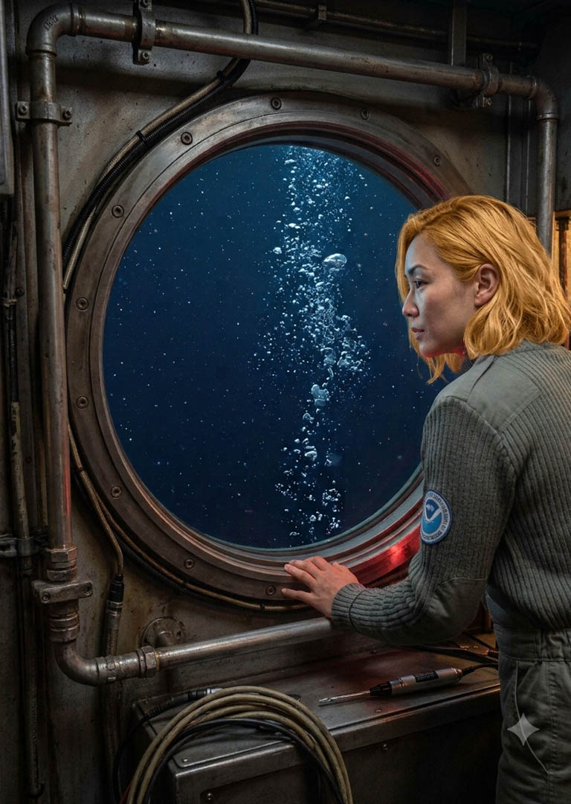

---

Unterwasser-Atmosphäre (Shader):

- Entwicklung des globalen Nebel-Shaders (Exponential Fog), der sich fließend von Cyan zu Tiefblau und schließlich zu absolutem Schwarz verfärbt.
- Wasser-Splatter- und Schlieren-Shader für die Bereiche der CAVE-Wände, die hinter den physischen Bullaugen liegen.
- Volumetrische Kegellichter für die virtuellen Scheinwerfer des Bootes (reagiert auf den Helligkeitswert des physischen Dimmers).

---

Partikeleffekte (VFX):
- Gischt und Luftblasen beim Durchstoßen der Wasseroberfläche.
- Kontinuierlicher "Marine Snow"-Partikeleffekt (Plankton), der nach oben strömt, um das Sinken zu visualisieren.
- Dichte, dunkle Staub- und Sedimentwolken, die von den Abbaufahrzeugen aufgewirbelt werden.
- Dichte, tiefschwarze Fluid-Rauchschwaden für die hydrothermalen Schlote (Schwarze Raucher).

---

<!-- _class: kapitelende-->

---
<!-- _class: structural -->

# Technische Infrastruktur, Tools & Vorhandene Assets

Welche Tools und Softwarewerkzeuge stehen uns zur Verfügung?
Welche Assets wurden bereits erstellt und können verwendet werden?

---

## Software-Stack & Hardware

Folgende Software ist an der thws
Röntgenring Raum D.4.01 / D.4.02 installiert

- 3ds max
- Blender
- AutoCAD / Revit
- Photoshop / Illustrator / Indesign
- Affinity Photo
- Gimp
- Unreal Engine 5.8
- Arduino IDE
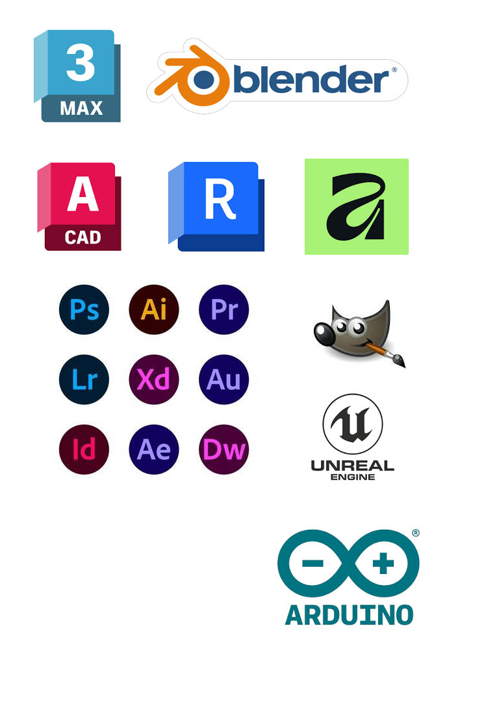

---

## Dokumentation & Kollaboration

- Dokumentation ausschließlich über Confluence:
https://vr-lab.atlassian.net/wiki/spaces/PG/pages/3016785921/Tiefsee-2026-27
- Versionsverwaltung via GitLab https://git.fiw.fhws.de/
Leeres Repository:
https://git.fiw.fhws.de/sauers/tiefsee-2026-27
- Versenden großer Datenmengen:
https://gigamove.rwth-aachen.de/de
- Versenden mittlerer Datenmengen / Archivierung:
https://cloud.thws.de/

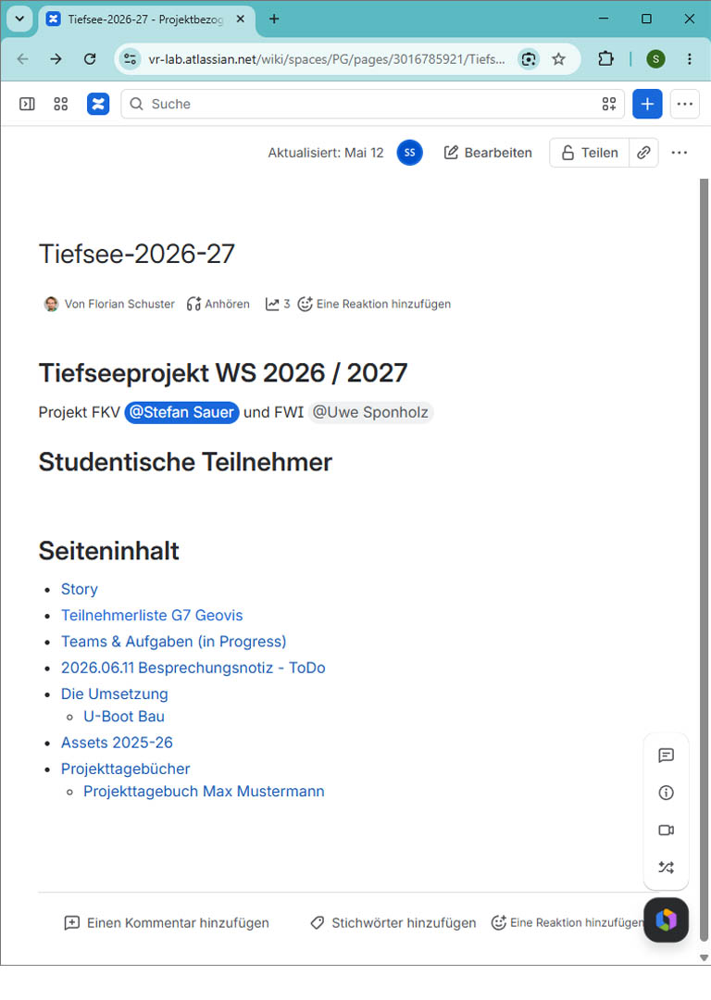

---

## Bestands-Assets aus 2025/26
(3D-Modelle, Animationen, Audio-Katalog)

Im WS 2025/2026 ist eine Vielzahl an Assets entstanden.
3D-Modelle mit / ohne Animation aus 3ds max, Blender, PolyCAM und Meshy.AI. +  Audio-Katalog

Die Assets sind katalogisiert unter:
https://vr-lab.atlassian.net/wiki/spaces/PG/pages/3035824129/Assets+2025-26

Download der Assets:
https://cloud.thws.de/s/52m4YAfWBSETkP9
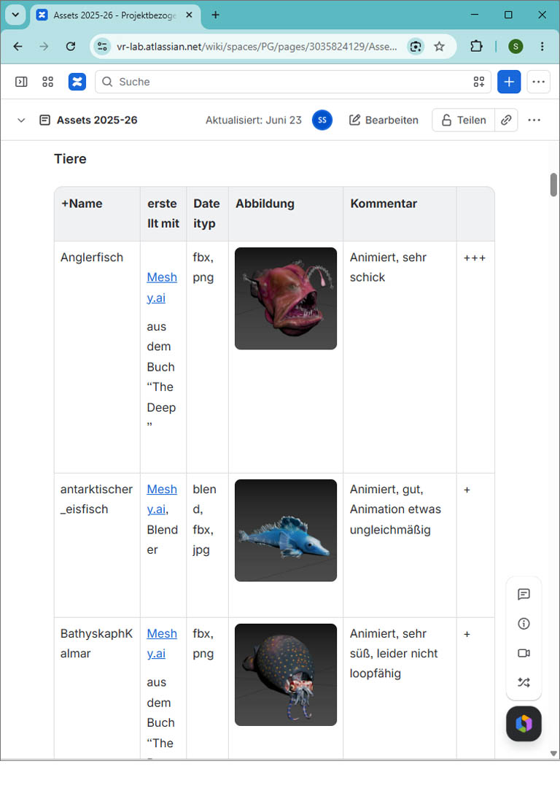

---

<!-- _class: kapitelende-->

---

<!-- _class: structural-->
# Inspirationen

Bilden Sie sich im Laufe des Semesters aus folgenden Unterlagen, Videos, Weblinks, Bilder und Grafiken, die Ihnen zur inhaltlichen und visuellen Gestaltung Ihres Projekts Inspirationen bieten können
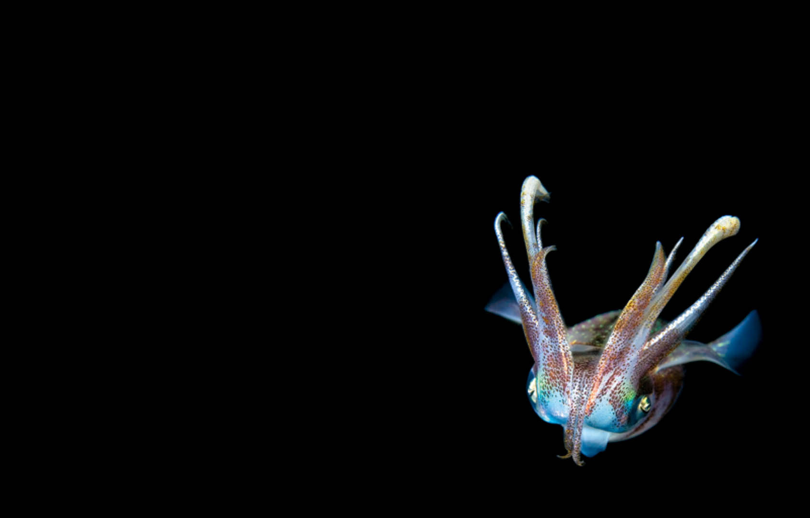

---
## Bücher
### Das dunkle Paradies

Von Antje Boetius
- Präsidentin des Monterey Bay Aquarium Research Institute (MBARI)
- Ehemalige Leitung des AWI

https://www.thalia.de/shop/home/artikeldetails/A1031276811

Leihgabe: https://cloud.thws.de/s/XmmppaSypHK85Sw

---
### The Deep | Leben in der Tiefsee

Von Claire Nouvian
- Wissenschaftsjournalistin
- Spezialisierung auf die Tiefsee
- Zusammenarbeit mit MBARI

Mit Arte Produktion des Filmes „Expedition in die Tiefsee“
Leihgabe als Buch verfügbar
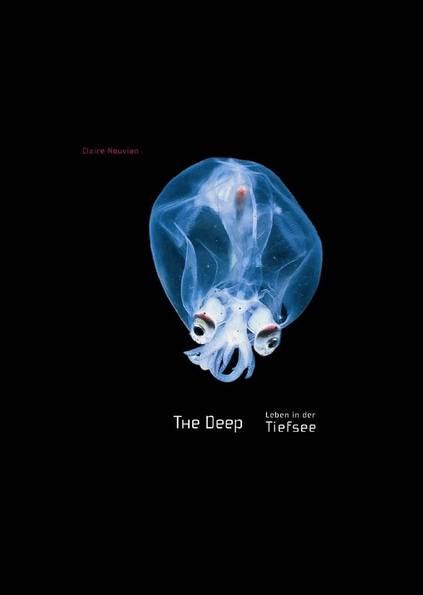

---
## Filme
### In der Tiefe des Atlantiks

Von Alexander Gerst auf Expedition
- Astronaut und Geophysiker
- Spezialisierung auf die Tiefsee

Tauchfahrt auf 1000 m Tiefe mit Antje Boetius
Link zum Film:
https://cloud.thws.de/s/BXn4Sobnw6gLAXB
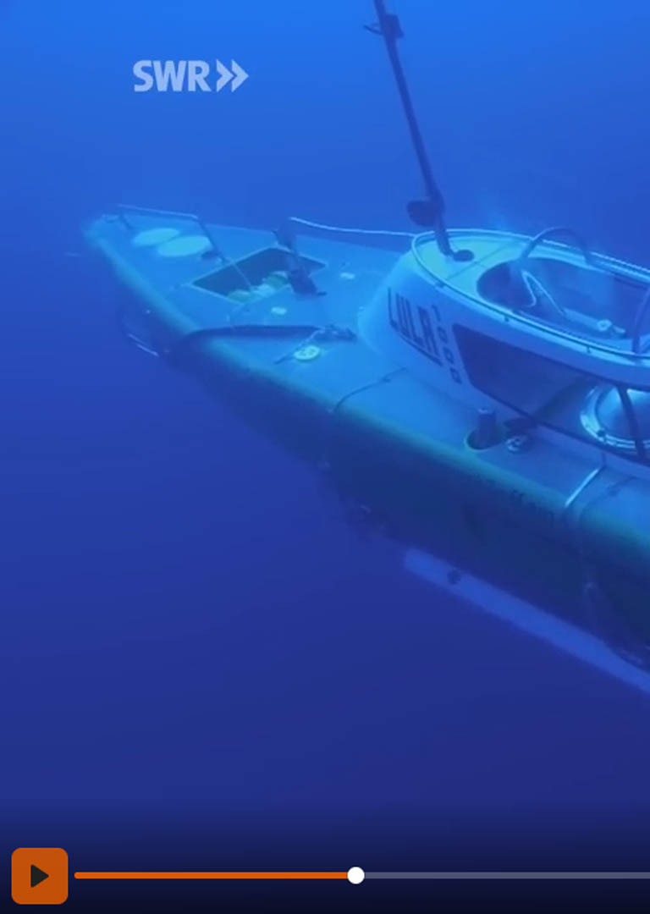

---
### Schwarze Raucher: Erzfabriken der Tiefsee

Geomar
- Bildung von Massivsulfiden
- Entstehung von Schloten
- Entstehung von wertvollen Rohstoffen

Link zum Film:
https://www.geomar.de/entdecken/videos/videos-singleansicht/schwarze-raucher-erzfabriken-der-tiefsee-1

---
### Extremophile: Leben an schwarzen Rauchern

Helmholtz
Link zum Film:
https://cloud.thws.de/s/26TowJ3RBEEmfS9

---
### Kämpferin für den Schutz der Meere

Antje Boetius | Deutscher Umweltpreis 2018
Deutsche Bundesstiftung Umwelt

Eine Dokumentation über das Leben und die Forschung von Antje Boetius
Link zum Film:
https://cloud.thws.de/s/Q3xBCjzEPEmXi6c

---
### Weitere Filme

Nachgefragt
Folge 1_ Wie entstehen Schwarze Raucher:
https://cloud.thws.de/s/dZjZQtK3Pd89XNP

Planet Wissen 
Expedition in die Tiefsee:
https://cloud.thws.de/s/5dx7csnwqGFBxKC

Schwarze Raucher, heiße Quellen Projekt Zukunft:
https://cloud.thws.de/s/K4ia3SapBiCSnob

---
## Material AWI
Original-Bilder und Filme von Forschungsmissionen des AWI
https://cloud.thws.de/s/kNJ4CGSLJTX6kto

---
## Artikel
Geomar:
Factsheet Massivsulfide 
- Schwarze Raucher
- Erzfabriken der Tiefsee

Die Zeit:
Tiefsee-Expedition vor Argentinien - Wie die Tiefsee Twitch eroberte

https://cloud.thws.de/s/LMnGsNDa93Nbka9

---

<!-- _class: kapitelende-->

>Und jetzt?

> Let`s Go...

---
<!-- _class: structural-->

> Fragen?

